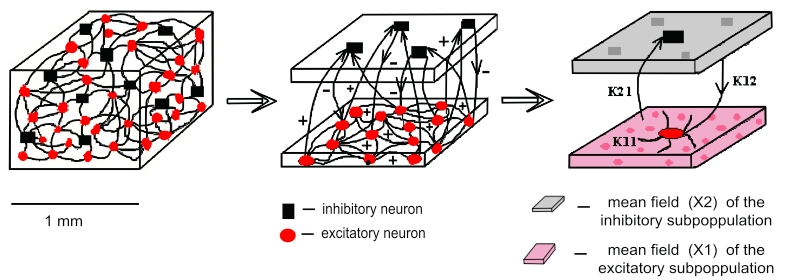
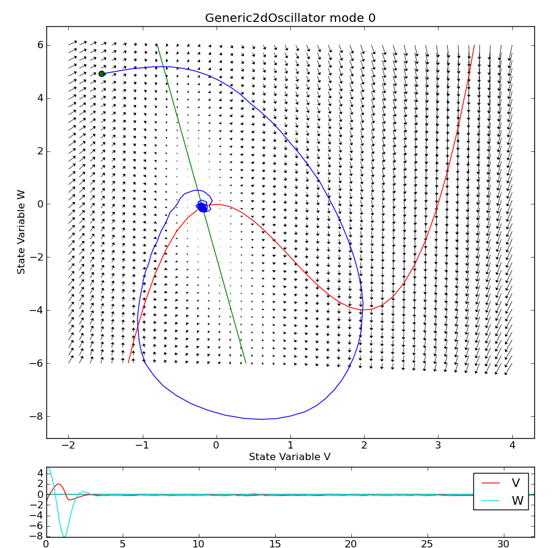

What is The Virtual Brain and why is it needed now?
---------------------------------------------------
.. OVERVIEW TEXT
.. might be used in the web page

|TVB| is a computational framework for the virtualization of brain structure and brain function. This is accomplished by simulating network dynamics using biologically realistic large-scale connectivity. TVB merges structural information on individual brains including 3D geometry of neocortex, white matter connectivity, etc. and then computationally simulates the emergent brain dynamics. The logic of TVB is the following: structural information poses certain constraints on the type of network dynamics that may emerge. Given certain brain structures such as connectivity, not every arbitrary brain dynamics can emerge but rather is limited to a particular dynamic repertoire. When brain structure is manipulated as in lesions or diseases, then the brain’s dynamic repertoire changes. TVB allows the systematic investigation of the brain’s dynamic repertoire as a function of various factors including structure, stimulation and task context. The TVB approach moves away from the investigation of isolated regional responses and considers the function of each region in terms of its dynamic interactions with other brain regions.  This allows us to (1) re-classify lesions in terms of the network of nodes (regions) and connections (axons, white matter tracts) that have been damaged and to (2) investigate the mechanisms that preserve function by understanding how regional damage affects the function of other parts of the network.  In this context, brain repair (recovery of function) depends on the restoration and rebalancing of activity in the remaining nodes in the network. 

Predicting and treating the consequences of brain damage has been notoriously difficult. This is because the relationship between the nature of the lesion and the functional deficit is highly variable across patients who have been grouped according to some classification metric (e.g. type of brain damage); and within individual patients who recover or deteriorate over time. A formalized explanation of such variability calls for (1) a re-evaluation of our classification metrics, (2) a better understanding of the mechanisms that preserve and/or restore function and (3) performance measures that are sensitive to subtle changes that occur over time. TVB offers a neuroinformatic framework to address these challenges.

TVB operates at the intersection of computational, cognitive and clinical neuroscience.  One achievement of this intersection has been that identification of key network principles that explain large-scale neural dynamics as highlighted in various publications (`Jirsa et al. 2010`_; `Deco et al. 2011`_). The important aspect of this work was the development of a large-scale model of primate neocortex.  Using a realistic anatomical connectivity matrix, based either on the CoCoMac database or MRI-based tractography work, these works demonstrated that the combination of accurate anatomy and local population noise was able to model the spatiotemporal patterns of the so-called “resting-state networks” that are a very active area of research (e.g., www.restingstate.com).  One important finding was that a delicate balance between anatomy and function exists wherein a slight change in either results is dissolution of the spatiotemporal structure.  The dynamics were completely intrinsically generated, leading to the hypothesis that brain noise may actually be a critical metric of healthy brain function.  Empirical investigation confirmed this hypothesis, showing that brain noise increases with maturation and correlates with stable cognitive function (McIntosh et al. 2010). 
 
 
What are the functional elements in The Virtual Brain?
------------------------------------------------------
.. might be used in the web page

TVB uses tractographic data (DTI/DSI) to generate connectivity matrices and build cortical and subcortical brain networks.  The connectivity matrix defines the connection strengths and time delays via signal transmission between all network nodes. Various neural mass models are available in the repertoire of TVB and define the dynamics of a network node.  Together, the neural mass models at the network nodes and the connectivity matrix define The Virtual Brain. TVB simulates and generates the time courses of various forms of neural activity including Local Field Potentials (LFP) and firing rate, as well as brain imaging data such as EEG, MEG and BOLD activations as observed in fMRI. 

Background leading to |TVB|
---------------------------
.. historical considerations
.. might be used in the web page

The Virtual Brain provides a neuroinformatics platform, which allows the simulation of large-scale brain network dynamics. The brain connectivity of TVB distinguishes region-based and surface-based connectivity. In the former case, the networks comprise discrete nodes and connectivity, in which each node models the neural population activity of a brain regions and the connectivity is composed of interregional fibers. In the latter case, cortical and subcortical areas are modelled on a finer scale in which each point represents a neural population model. This approach allows a detailed spatial sampling in particular of the cortical surface resulting in a spatially continuous approximation of the neural activity known as neural field modelling (`Wilson Cowan 1972`_; `Nunez 1974`_, `Amari 1978`_; `Jirsa Haken 1996`_; `Robinson 1997`). Here the connectivity is composed of local intracortical and global intercortical fibers. When simulating brain activity in the simulator core of TVB, then the neural source activity time courses from both region or surface-based approaches are projected into EEG, MEG and  BOLD (blood oxygen level dependent contrast) space using a forward model (`Breakspear Jirsa 2007`_). The first neuroinformatic integration of these elements has been performed by (`Jirsa et al 2002`_) demonstrating neural field modelling in an event related paradigm. Homogeneous connectivity along the lines of (`Jirsa Haken 1996`_) was implemented. Neural field activity was simulated on a spherical surface for computational efficiency and then mapped upon the convoluted cortical surface with its gyri and sulci. The forward solutions of EEG and MEG signals have been computed and showed that a surprisingly rich complexity is observable in the EEG and MEG space, despite simplicity in the neural field dynamics. In particular, neural field models (`Wilson Cowan 1972`_; `Nunez 1974`_, `Amari 1978`_; `Jirsa Haken 1996`_; `Robinson 1997`_) have a spatial symmetry in their connectivity, which is always reflected in the symmetry of the resulting neural source activations, even though it may be significantly less apparent (if at all) in the EEG and MEG space.  This led the authors to conclude that the integration of tractographic data is imperative for future large-scale brain modelling attempts, since the symmetry of the connectivity will constrain the solutions of the neural sources, but not trivially show itself in the other imaging spaces of EEG, MEG and Bold. 

The network nodes in |TVB| are neural populations with local mesoscopic dynamics
----------------------------------------------------------------------------------

The brain contains :math:`10^{11}` neurons linked by :math:`10^{15}` connections, with each neuron having inputs in the order of :math:`10^{5}`. The complex and highly-nonlinear neuronal interaction patterns are only poorly understood and the number of degrees of freedom of a microscopic model attempting to describe every neuron, every connection and every interaction is astronomically large and therefore far too high for fitting it directly with recorded macroscopic data. The gap between the microscopic sources of scalp potentials at cell membranes and the recorded macroscopic potentials can be bridged by an intermediate mesoscopic description. Mesoscopic dynamics describe the activity of populations of neurons organized as cortical columns or subcortical nuclei. Several features of mesoscopic and macroscopic electric behaviour, e.g., dynamic patterns like synchrony of oscillations or evoked potentials, show good correspondence to certain cognitive functions, e.g., resting-state activity, sleep patterns or event related activity. 

Mesoscopic dynamics describe the mean field activity of populations of neurons organized as cortical columns or subcortical nuclei. Common assumptions in mean-field modeling are that explicit structural features or temporal details of neuronal networks (e.g. spiking dynamics of single neurons) are irrelevant for the analysis of complex mesoscopic dynamics and the emergent collective behavior is only weakly sensitive to the details of individual neuron behaviour (`Breakspear Jirsa 2007`_). Basic mean field models capture changes of the mean firing rate (`Brunel Wang 2003`_), where as more sophisticated mean field models account for parameter dispersion in the neurons and the subsequent richer behavioural repertoire of the mean field dynamics (`Assisi et al 2005`_; `Stefanescu Jirsa 2008`_, 2011; `Jirsa Stefanescu 2010`_). These approaches demonstrate the relatively new concept from statistical physics that macroscopic physical systems obey laws that are independent of the details of the microscopic constituents they are built of (`Haken 1972`_). These and related ideas have been exploited in neurosciences (`Kelso 1995`_; `Buzsaki 2006`_). Thus, our main interest lies in deriving the mesoscopic laws that drive the observed dynamical processes at the macroscopic scale in a systematic manner.

   Figure :counter:`figure`. Schematic of the local source node network architecture underlying mean field modelling.
 
   Excitatory (red circles) and inhibitory (black squares) neurons occupy a volume (left). 
   Couplings are indicated by black connecting lines. Conceptually both neuron types can be 
   clustered in two subpopulations (middle). Each subpopulation can be then characterized 
   by a mean behaviour under certain conditions  (right) and a mean connectivity (:math:`K_{11}`, :math:`K_{21}`, :math:`K_{12}`). 
   (Figure courtesy (`Stefanescu Jirsa 2008`_)).

Noninvasive neuroimaging signals constitute the superimposed representations of the activity of many sources leading to high ambiguity in the mapping between internal states and observable signals, i.e., the pairing between internal states of the neural network and observed neuroimaging signals is surjective, but not bijective. As a consequence, the EEG and MEG backward solution is underdetermined (`Helmholtz 1853`). Therefore, a crucial step towards the outlined goals is the correct synchronization of model and data, that is, the alignment of model states with internal - but often unobservable – states of the system.

Various mean-field models are available in |TVB| reproducing typical features of mesoscopic population dynamics. For each node of the large-scale network, a neural population model describes the local dynamics. The neural population models in TVB are well-established models derived from the ensemble dynamics of single neurons (`Wilson Cowan 1972`_; `Jansen Rit 1995`_; `Larter 1999`_;  `Brunel Wang 2003`_; `Stefanescu Jirsa 2008`_). Given its phenomenological nature, |TVB| offers also a generic two-dimensional oscillator model for the use at a network node. This choice is motivated by various reasons, but foremost by the fact that (`Stefanescu Jirsa 2008`_) have shown that neuronal population models often preserve the mathematical form of the single neuron equations, from which they have been derived. Given that many single neuron models have only two state variables (`FitzHugh 1961`; `Nagumo 1962`, `Morris Lecar 1981`, `Hindmarsh Rose 2004`), a 2D generic oscillator model can be justified phenomenologically and is capable of generating a wide range of phenomena as observed in neuronal population dynamics such as multistability, coexistence of oscillatory and non-oscillatory behaviors, various behaviors displaying multiple time scales, etc. just to name a few.

The generic large-scale brain network equation in |TVB|
------------------------------------------------------------------------------

When traversing the scale to the large-scale network, then each network node is governed by its own intrinsic dynamics in interaction with the dynamics of all other network nodes. This interaction happens through the connectivity matrix via specific connection weights and time delays due to signal transmission delays. The following (generic) evolution equation (`Jirsa 2009`_) captures all the above features and underlies the emergence of the spatiotemporal network dynamics in |TVB|:

.. math::
    \dot{\Psi(x,t)} = N(\Psi(x,t)) + \int_{\Gamma}g_{local}(x,x')S(\Psi(x',t))dx' + 
.. math::
    \int_{\Gamma}g_{global}S(\Psi(x',t - \frac{|x-x'|}{\nu}))dx' +  I(x,t) + \xi (x,t)

The equation describes the stochastic differential equation of a network of connected neural populations. :math:`\Psi(x,t)` is the neural population activity vector at the location :math:`x` in 3D physical space and time point :math:`t`. It has as many state variables as are defined by the neural population model, which is specified by
:math:`N(\Psi(x,t))`. The connectivity distinguishes local and global connections, which are captured separately in two expressions. The local network connectivity :math:`g_{local}(x,x')` is described by connection weights between :math:`x` and :math:`x'`, whereas global connectivity is defined by :math:`g_{global}`. The critical difference between the two types of connectivity is threefold: 

#. Local connectivity is short range (order of cm) and global connectivity is long range (order of 10cm). 
#. Signal transmission via local connections is instantaneous, but via global connections undergoes a time delay dependent on the distance :math:`|x-x'|` and the transmission speed :math:`\nu`. 
#. Local connectivity is typically spatially invariant (of course with variations from area to area, but generally it falls off with distance), global connectivity is highly heterogeneous. 

Stimuli are introduced into the Virtual Brain via the expression :math:`I(x,t)` and are defined over a location :math:`x`   with a particular time course. 

Noise plays a crucial role not only for the brain dynamics, but probably also for brain function (see `McIntosh et al. 2010`). In TVB it is introduced via the expression  where the type of noise and its spatial and temporal correlations can be specified independently. 

Various numerical algorithms are available in |TVB| and can be coarsely categorized into deterministic (no noise) and stochastic (with noise) They include the Heun algorithm, Runge Kutta of various orders, Euler Maruyama, and others. 

|TVB| default node model: a 2D generic oscillator
~~~~~~~~~~~~~~~~~~~~~~~~~~~~~~~~~~~~~~~~~~~~~~~~~~

This choice is motivated by various reasons, but foremost by the fact that a wide range of neuron models can be described by the a 2D dynamic system and that (`Stefanescu Jirsa 2008`_) have shown that population models of such neuron models preserve the mathematical form of the single neuron equations. 2D generic oscillator models generate a wide range of phenomena as observed in neuronal population dynamics such as multistability, coexistence of oscillatory  and non-oscillatory behaviors, various behaviors displaying multiple time scales, to name just a few. 

.. figure:: images/phase_plane_trajectory_2dGenericOscillator_bistability.png
   :scale: 50 %
   :alt: bistable configuration

   Figure :counter:`figure`. Bistable configuration.  
 
   A fixed point and a limit cycle coexist when :math:`I_{ext}` is set to 0. If :math:`I_{ext}=-2`, then the equilibrium is only a fixed point.

   Figure :counter:`figure`. Excitable configuration.
 
   The model exhibits FitzHugh-Nagumo dynamics. If :math:`a=2` the dynamics correpond to an oscillator (limit cycle).

3. Configuration

.. figure:: images/phase_plane_trajectory_2dGenericOscillator_SNIC.png
   :scale: 50 %
   :alt: SNIC configuration

   Figure :counter:`figure`. Saddle Node bifurcation on the Invariant Circle (SNIC) configuration.
 
   The model exhibits Morris-Lecar dynamics. 
   
   
   
EEG-MEG forward solution in |TVB|
..................................

Noninvasive neuroimaging signals constitute the superimposed representations of the activity of many sources leading to high ambiguity in the mapping between internal states and observable signals, i.e., the pairing between internal states of the neural network and observed neuroimaging signals is surjective, but not bijective. As a consequence, the EEG and MEG backward solution is underdetermined (`Helmholtz 1853`_). Therefore, a crucial step towards the outlined goals is the correct synchronization of model and data, that is, the alignment of model states with internal - but often unobservable – states of the system.

The forward problem of the EEG and MEG is the calculation of the electric potential :math:`V(x,t)` on the skull and the magnetic field :math:`B(x,t)` outside the head from a given primary current distribution :math:`D(x,t)`. The sources of the electric and magnetic fields are both, primary and return currents. The situation is complicated by the fact that the present conductivities such as the brain tissue and the skull differ by the order of 100. In |TVB| three compartment volume conductor models are constructed from structural MRI data using the MNI brain; surfaces for the interfaces between grey matter, cerebrospinal fluid and white matter are approximated with triangular meshes. For EEG predictions, volume conduction models for skull and scalp surfaces are incorporated. Here it is assumed that electric source activity can be well approximated by the fluctuation of equivalent current dipoles generated by excitatory neurons that have dendritic trees oriented roughly perpendicular to the cortical surface and that constitute the majority of neuronal cells (~85 % of all neurons). So far subcortical regions are not considered in the forward solution. We also neglect dipole contributions from inhibitory neurons since they are only present in a low number (~15 %) and their dendrites fan out spherically. Therefore, dipole strength can be assumed to be roughly proportional to the average membrane potential of the excitatory population. Then the primary current distribution :math:`D(x,t)` is obtained as the set of all normal vectors perpendicular to the vertices at locations x of the cortical surface multiplied by the relevant state variable in the population vector  .

fMRI-Bold contrast in |TVB|
...........................

The BOLD signal time course is approximated from the mean-field time-course of excitatory populations accounting for the assumption that BOLD contrast is primarily modulated by glutamate release (Petzold, Albeanu et al. 2008; Giaume, Koulakoff et al. 2010). Apart from these assumptions, there is relatively little consensus about how exactly the neurovascular coupling is realized and whether there is a general answer to this problem. In order to estimate the BOLD signal, the mean-field amplitude time course of a neural source may be convolved with a canonical hemodynamic response function as included in the SPM software package (http://www.fil.ion.ucl.ac.uk/spm) or the “Balloon-Windkessel” model of (Friston, Harrison et al. 2003) may be employed; cf. (`Bojak, Oostendorp et al. 2010`_) for some more technical details.

