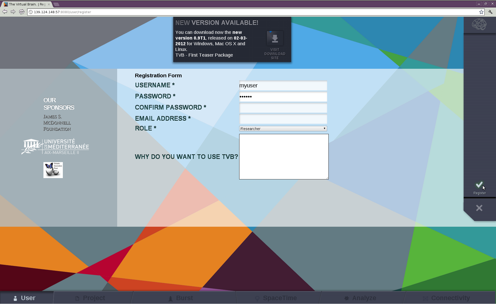
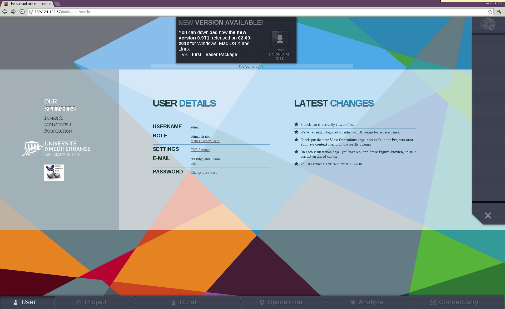
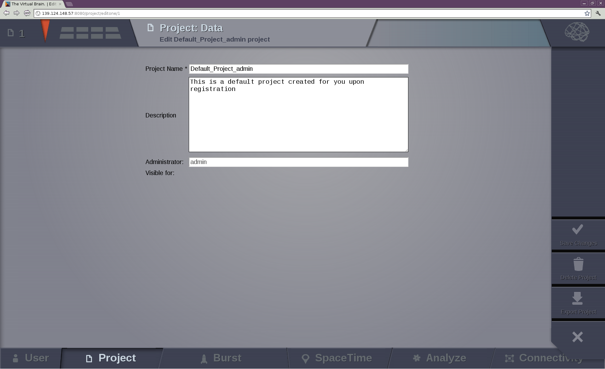
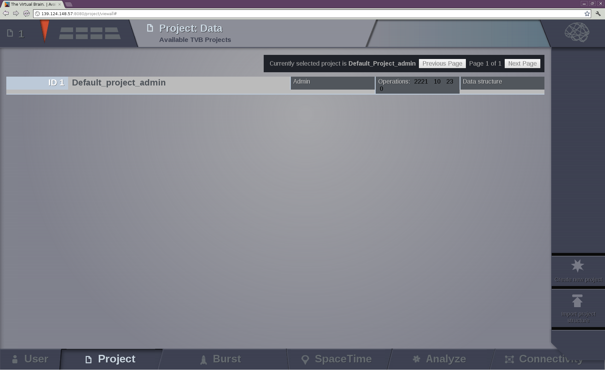
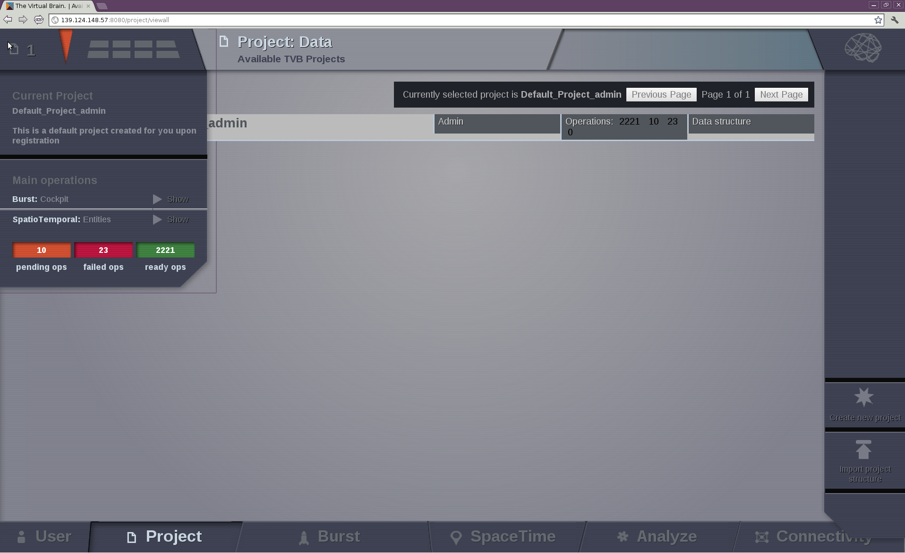
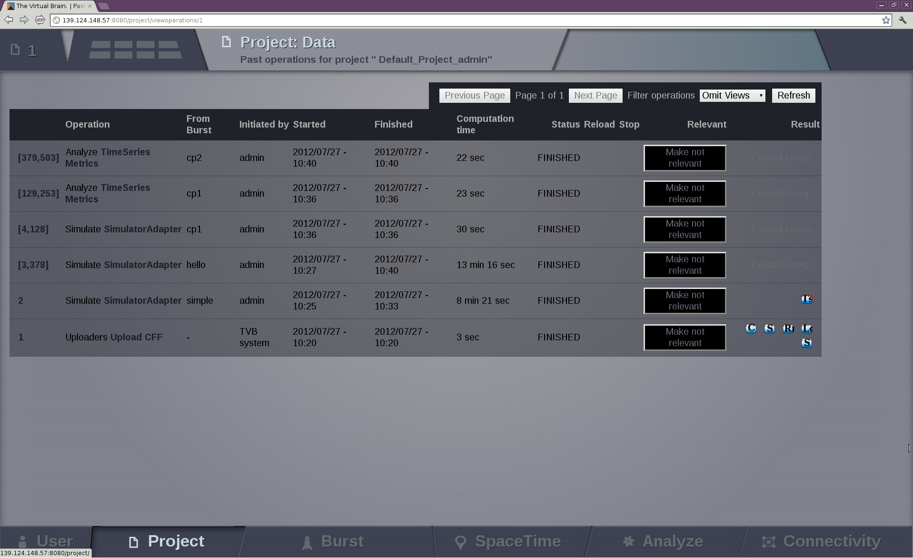
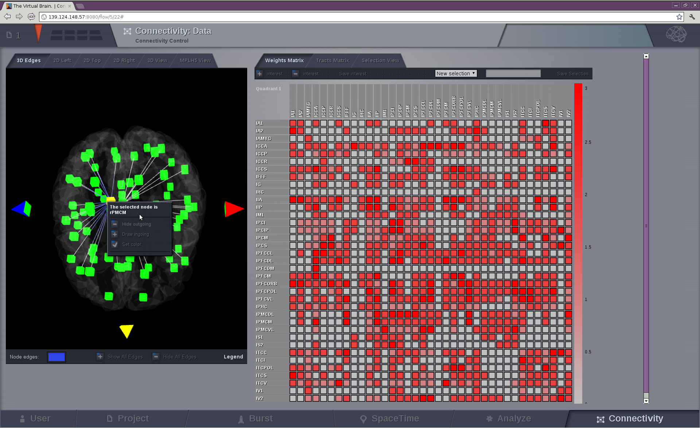
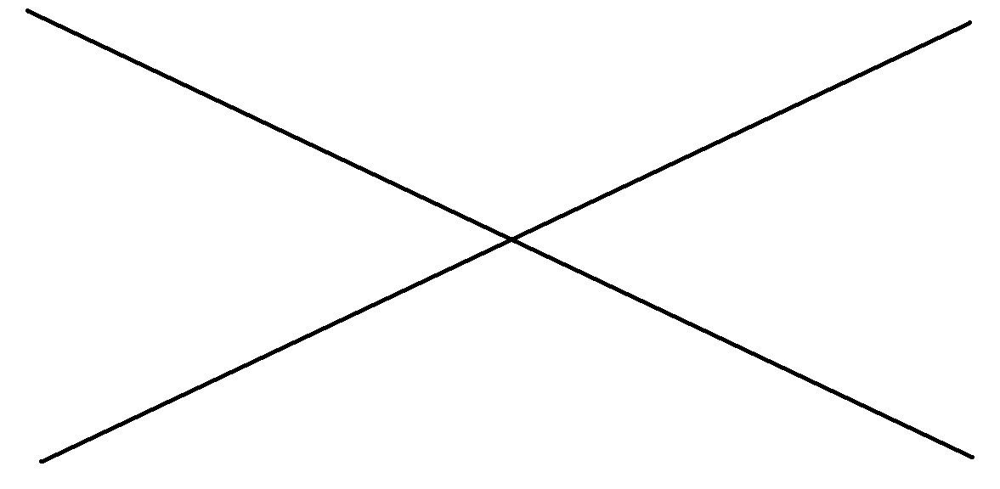

.. |TITLE| replace:: User's Guide
.. |DESCRIPTION| replace:: Users's Guide presents the main functionalities of |TVB|
.. |VERSION| replace:: 1.0
.. |REVISION| replace:: 0.1

.. include:: templates/header_footer.rst   

|TVB| is a framework for the simulation of the dynamics of large-scale brain networks with biologically
realistic connectivity. |TVB| uses tractographic data (DTI/DSI) to generate connectivity matrices and build
cortical and subcortical brain networks. The dynamics of these networks is simulated and generates the time
courses of Local Fields Potentials in the brain, as well as brain imaging data such as EEG, MEG and BOLD
activations as observed in fMRI. Possible simulation studies currently include studies of the resting state,
lesions, and various stimulation paradigms. |TVB| is foremost a simulation platform, but also provides
a set of classical time series analysis tools, structural and functional connectivity analysis tools, as
well as parameter exploration facilities by launching parallel simulations on a cluster.

This document provides the most basic tutorial to get the new user started working with the first versions
of |TVB|. This version displays the full functionality of |TVB|. It is not limited to the basic simulation
and visualization functions, it now allows the user to handle parameter manipulation, stimulus generation
and connectivity edition. As the application will be regularly updated over the next few months so will
be this documentation. Hence please check regularly for updates on the web site: |TVB_URL|.

The principal structure of the workflow of |TVB| is composed of USER, PROJECT, BURST, SPACE-TIME, ANALYZE
and CONNECTIVITY. In **Project**, the individual projects are defined with all their data and
infrastructure. In **Burst** the large-scale simulation is defined and different options to view
structural and functional data are offered in 2D, 3D, as well other representations to visualize results.
Having multiple panels allow to have a quick overview of the current model parameters, simulations and
results. In **Analyze** certain options for data and connectivity analysis are offered.
In **SpaceTime**, stimulation patterns can be generated. And finally in **Connectivity**, the
user can edit the connectivity matrices assisted by interactive visualization tools.

Launch the Application
======================

On Linux
--------

Unzip the package and it will create a folder TVB_Distribution. In this folder
you should find a number of scripts. To start |TVB| you should run the `tvb_start.sh`
script. You can at any time run the `tvb_start_clean.sh` which will start tvb in a
clean state, resetting your program database and deleting all the |TVB| create folders.

To make sure that no processes will remain opened after you use the application, you
should always close |TVB| by running the `tvb_stop.sh` script.

On MacOS
--------

Unzip the package and it will create a folder TVB_Distribution. In this folder
you should find a number of scripts and an application package. To start |TVB| you
should double click on the `tvb.app` application. You can at any time run the
`tvbStartClean.command` which will start tvb in a clean state, resetting your program
database and deleting all the |TVB| create folders.

To make sure that no processes will remain opened after you use the application, you
should always close |TVB| by running the `tvbStop.command` script.

On Windows
----------

Unzip the package and it will create a folder TVB_Distribution. In this folder
you should find a number of bat scripts and an executable. To start |TVB| you
should double click on the `tvbStart.exe` executable. You can at any time run the
`tvbStartClean.bat` which will start TVB in a clean state, resetting your program
database and deleting all the |TVB| created folders.

.. raw:: pdf

   PageBreak oneColumn
   

User Interface of |TVB| Framework
=================================

Once started, |TVB| should automatically open your default browser and start on the
default `http://127.0.0.1:8080/settings/settings`. If not, you should manually open your favorite browser from our
list of supported browsers and open the before mentioned URL. This should open up the
following settings page:

.. figure:: screenshots/settings.png
   :width: 90%
   :align: center

   Settings Page

These are the configurable settings for |TVB|. Note that the `Name` of the administrator
is the only one that cannot be changed later on. The others will be accessible afterwards
from the profile page of the administrator. These settings are:

Name:
	the name of the administrator.

Password:
	the password of the administrator. This can be changed later by clicking the
	`Change password` link from the profile page.

Email:
	the email of the administrator. Emails requesting validations for new users will
	be sent to this address. This can be changed by clicking the `edit` link from the
	profile page.

TVB root:
	this is the root storage for |TVB|. All your projects will be stored here, as well
	as the logger file and the files used as input and output for the backend server.
	This will still be available on the settings page later on. The settings page is
	available for an administrator through the `TVB Settings` like from the profile page
	at any later time.

DB type:
	currently supported are *sqlite* and *postgresql* databases. You will need to provide a
	valid database URL in case you choose postgresql. In the case of sqlite a default
	`tvb-database.db` will always be used. Please take into consideration that when
	switching to a new database **your existing data will be lost**.

Server name:
	usually the IP of the server that will run |TVB|. You can also leave it to the default
	if you are just running |TVB| locally.

Cherrypy port:
	the port used by cherrypy. You need to make sure this port is not used by some other
	application otherwise |TVB| will not start.

Matplotlib port:
	the port used by matplotlib. You need to make sure this port is not used by some other
	application otherwise some visualizers will not work.

Deploy on cluster:
	set true if you want to run |TVB| on a cluster environment.

RPC server:
	if you are not running on a cluster, this will be the port used by the backend server. If
	`Deploy on cluster` is checked this will not be used.

After selecting your desired settings press the `Apply` button. This will restart |TVB| with the
new settings. The restart could take a few minutes.

Register
--------

If you want to create a new user, you should `register` using the `new account
link` which gives the following form:

   |TVB| register page

.. .. note:: 
   
   The roles should not contain 'researcher/clinician' since clinicians can also
   do research but more specifically level of user 'basic/regular/advanced'

When the `register` button is clicked, an email is sent to `ADMINISTRATOR_EMAIL`
address. This is the administrator's task to validate the new account. The
administrator needs to be logged in to validate an account.

Login
-----

You can log into the platform once registered and validated or by using the
admin credentials you set in the `settings page`. Then, click on the `login` button on the
right of the page which will bring you to:

   The User Details page

Main Interface Description and Typical Workflow
-----------------------------------------------

On the right, the `login` button has changed to a `logout` button with obvious
functionality.

The main menu of |TVB| interface lays at the bottom of the page and is composed
of six basic options:

User:
    where user's details are managed.

Project:
    where projects are defined and administered.

Burst:
    where Simulate, Analyze and View are combined to have a quick overview of the ongoing Project.

SpaceTime:
    where spatiotemporal stimuli can be generated.

Analyze:
    where experimental and simulated data can be analyzed.

Connectivity:
    where connectivity visualization and editing facilities of |TVB| are stored.

These options sum up the typical workflow within |TVB| framework which proceeds
through these steps:

1. a project is defined and/or selected and user data, e. g. a connectivity matrix, are uploaded into this project;

2. new data is obtained by simulating large scale brain dynamics with some set of parameters;

3. results are analyzed and visualized;

A history of launched simulations is kept to have the traceability of the different
modifications that took place in the simulation chain.

User Area
---------

Gives access to the user management system which will allow the user to enable/disable
or edit user capabilities for projects.

This is also the option that you select in order to log out.

Project Area
------------

Data and simulations are organized within projects. They correspond to
directories where related data sets and simulation results are stored.

When the `Project` option is selected you should have the default project created
for you on user registration:

.. figure:: screenshots/default_project.png
   :width: 90%
   :align: center

   The default `Project`

You can edit this by clicking on the `Project Properties` option which leads to the project's form (this form is also reached by clicking the
`Create New Project` button in the `View All Projects` option):

   The project form

where a project name (*without spaces*) should be chosen/edited and a short description should be given.
When other users are registered in the framework, you can choose to
share the project with other users by checking their respective 'Visible for' boxes.
Then Save changes (button located on the right side), to get back to the page where
projects can be selected; the new project is now present:

   The project selection and adminstration page.

Projects are selected using their **id** on the left column. Once a project is
selected, you can get information on your project by pointing to the upper left corner of
the interface:

   The main information about the selected project. 

To navigate through the `Project` area, there is a second level
menu in the top left corner, next to the Project number.

.. figure:: screenshots/project_area.png
   :width: 90%
   :align: center

   The `Project` area

This area consists of:

- Operations: to browse the history of operations related to the project.A table with the current
  project operations is displayed. From this board the user can filter, view, reload or
  cancel any operation.

   The operation page with default operations

	- Project Properties: to edit current project properties, export or remove the project.
  
	- Data Structure: to navigate through the existent data in the current project. Analysis and Visualizers can be launched from this area. It allows to edit	the structure of the data storage. On the right,`upload` buttons appear	for each type of TVB-compatible data. 
	
		- Upload CFF: connectome format
		- Upload Surface GIFTI
		- Upload NIFTI
		- Upload TVB DataType
		- Upload Sensors
		- Upload Connectivity
		- Upload Surface

.. figure:: screenshots/data.png
   :width: 90%
   :align: center

   The data structure of our project with default data.

.. figure:: screenshots/data_description.png
   :width: 90%
   :align: center

   The description of the data appear when they are selected.

	- View all Projects: to switch to another project or import a previously saved project.

	- Saved Figures: to display all the print-screens from visualizations.

	- DTI Pipeline: if the proper virtual machine exists, a DTI pipeline can be launched in order obtain a connectivity matrix from DTI data. 

.. SIMULATOR PART 

.. include:: Simulator.rst   

.. Integrator
        the integration scheme for the (possibly stochastic) differential equations
        and integration step (in physical unit).
    Surface
        the surfaces (cortex, skull, skin) for the resolution of forward problems.
    Monitors
        the data registered during the simulations.
    Connectivity
        connectivity matrix to use in the simulation.
    Coupling
        coupling fucntion between nodes of the network.
    Stimulus
        optional stimulation of the brain.
    Model and parameters:
        model type (such as Fithugh-Nagumo for example) and the parameters used in
        the simulation.
    Simulation length:
        duration in physical time of the simulation (not to be confused with the
        computing duration)
    `Launch` and `Cancel` buttons on the right. 
    
    
Analyze Area
------------

This option offers a (currently limited) set of techniques for data
(experimental or simulated) analysis.

.. figure:: screenshots/analyze.png
   :width: 80%
   :align: center

   The current available analyzers

The techniques currently offered here are:
	- Continuous Wavelet Transform
	- Fourier Transform
	- Temporal Coherence of Nodes
	- Principal Component Analysis
	- Global Variance
	- Cross Correlation of Nodes
	- Timeseries metrics (?)
	- Temporal Covariance of Nodes
	- Variance of the Variance of Nodes

For mathematical details see the Reference Manual.
.. crossrefrence needed 

Brain Connectivity Toolbox Analyzers
....................................

If you have `matlab` or `octave` installed and available through the command line
then all the algorithms offered by `Brain Connectivity Toolbox` can be used directly
from |TVB| interface and the results can later be displayed in one of our visualizers.

Connectivity Area
-----------------

.. figure:: screenshots/connectivity_area.png
   :width: 90%
   :align: center

Connectivity 3D
...............

Connectivity 3D Edges
~~~~~~~~~~~~~~~~~~~~~

This connectivity visualizer allows you to see the structural information as
base model part of TVB. On the left panel, the connectivity matrix is displayed
in 3D.

.. figure:: screenshots/connectivity.png
   :width: 90%
   :align: center

   Preview for Connectivity Viewer 3D Edges

The 3D semi-transparent surface arround the connectivity nodes, whether it is
the cortical surface or the outer-skin, is used just for giving space guidance.

You can select an individual node and righ-click on it to visualize the incoming
or outgoing edges. For each node you can choose a different color to apply to its
edges.

   Preview for Connectivity Viewer 3D Edges - Coloring incoming / outgoing edges

Connectivty 3D View
~~~~~~~~~~~~~~~~~~~

A 3D (WebGL) representation of the connectivity matrix.
Two specific node-measures can be displayed here by node gradient colors and
different node sizes.

.. figure:: screenshots/connectivity3d.png
   :width: 90%
   :align: center

   Preview for Connectivity 3D Viewer
 

Connectivity 2D Viewer
......................

A 2D representation of the connectivity matrix.

One can select node-by-node in the connectivity, to emphasize connections
between nodes and strength. Views are 2D Left, 2D Top and 2D Right.

.. figure:: screenshots/connectivity2d_left.png
   :width: 30%
   :align: left

.. figure:: screenshots/connectivity2d_top.png
   :width: 30%
   :align: center

   Preview for Connectivity 2D Viewer

Connectivity Matrix Editor
~~~~~~~~~~~~~~~~~~~~~~~~~~

On the right of every Connectivity display, a 2D table is also available for
easily editing the connectivity and the tract matrix, e.g., perform lesions and
save changes for a compared simulation.

You can select the quadrant to be displayed on the 2D table by accesing the
quadrant selector on the upper left corner of the matrix:

	- quadrants 1 and 4 are the intra-hemisphere connectivity weights,

	- and quadrants 2 and 3 are the inter-hemisphere connectivity weights.

.. figure:: screenshots/connectivity_quadrants.png
   :width: 90%
   :align: center

   Preview for Quadrant Selection

The Selection View tab on top of the connectivity matrix, labeled as *Weights
Matrix*, allows you to perform basic algebraic operations on a set of nodes.
In addition to that, you can specify the edge type, i.e., if the connection
strengths to be modified are going out or coming in from/to the selected nodes.

.. figure:: screenshots/connectivity3d_edges_operations.png
   :width: 90%
   :align: center

   Preview for Selection View

The operations are:
	- Assignation (set): assigns the given numeric value to all the nodes within the set.
	- Addition (add): adds the new value to the current value in the connectivity matrix.
	- Subtraction (decrease): subtracts the new value to the current value in the connectivity matrix.
	- Multiplication (multiply): multiplies the current value in the connectivity matrix by the given numeric value.
	- Division (divide): divides the current value in the connectivity matrix by the given numeric value.

Hit the `Run` button to perform the selected operation.

By default the set includes all the nodes. You can deselect the nodes from the
node list. If you wish to save a particular selection, enter a new name and hit
the Save Selection button.

.. figure:: screenshots/connectivity3d_newselection.png
   :width: 90%
   :align: center

   Preview for New Selection

The Connectivity Matrix editor allows you to perform lesions and save this changes
in a new connectivity matrix:

	- Deselect the nodes you want lesion by clicking directly on the region	labels. This will remove all the incoming and ongoing connections into	and from those nodes.
	- Hit the `Save Interest` button to save the new connectivity matrix.
	- Press the `Refresh` button below the Connectivity Matrix field, to see your new matrix. Select it.
	- `Launch` the viewer again

Your connectivity matrix should be displayed. The connection strengths of the
lesioned nodes should be set to 0.

Matrix  MPLH5 View
..................

A 2D (matplotlib) representation of the connectivity matrix. Here, the four
quadrants of the weights matrix can be observed.

.. figure:: screenshots/connectivity_mplh5.png
   :width: 90%
   :align: center

   Preview for Matrix Display

Burst Area
----------

Configurable multipanel display that combines |TVB| simulation, analysis and
visualization capabilities.

.. figure:: screenshots/burst.png
   :width: 90%
   :align: center

   Preview for Burst Area

Through this interface, the user can have a quick glimpse (*burst*) of the dynamics
of a certain set of parameters. Moreover, it allows to explore the local dynamics model parameter space
(currently up to 2 parameters within the same *Burst* are supported) in a very methodological way.
From those results, the user will get an idea (a hint) of the most interesting parameter
combination to launch longer simulations.

You can save a new *Burst*, i.e., save a new set of parameters for a given model
or to save a simulation using a different model.

A history of previous *Bursts* is kept and can be accessed at any time.

On the right side there are configurable tabs which allow you to personalize
the windows to be displayed (from Analyzers or simple Visualizers).

Each window can be displayed in full screen by pressing the `Launch full visualizer`
button.

Some of the available visualizers are described below.

Brain Visualizer
................

A 3D (WebGL) visualization of the brain activity.

This visualizer displays the activity on the surface level (fine granularity - each
surface vertex has an individual measure) or on the region level
(coarse-granularity - each region is represented with only one color).

.. figure:: screenshots/brain.png
   :width: 90%
   :align: center

   Preview for Brain Viewer

EEG Visualizer
..............

An animated 2D EEG-like visualization of a timeseries.

You have the option to select particular channels for display
(at startup only maximun 10 are displayed).
You can zoom by selecting a specific area with mouse-selection.

.. figure:: screenshots/eeg.png
   :width: 90%
   :align: center

   Preview for EEG Viewer

BrainEEG
........

A synchronized side by side representation with a 3D webGL and a 2D EEG-like visualization
of brain activity.

.. figure:: screenshots/braineeg.png
   :width: 90%
   :align: center

   Preview for BrainEEG Viewer
   

.. raw:: pdf

   PageBreak oneColumn
   

Topographic Viewer
..................

A comparison between a maximum of 3 brain maps. Each map associates
a vector value to a node in the connectivity matrix.

.. figure:: screenshots/topografic.png
   :width: 90%
   :align: center

   Preview for Topographic Visualizer

.. DATA EXCHANGE

.. include:: DataExchange.rst 

