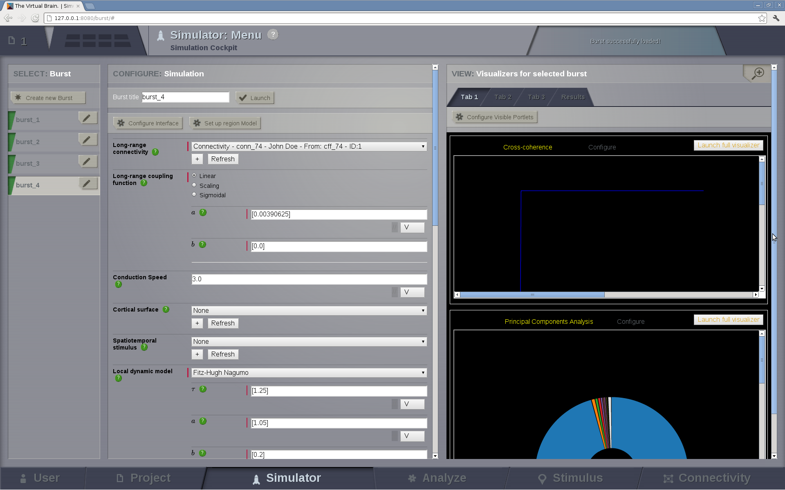

Simulation Environment
----------------------

    
    The interface for the TVB Simulator
    

In the following we briefly describe the input parameters and other functional
elements of the simulator interface. For more, detailed and technical
explanation, please refer to the Reference Manual or the Scientific Report.

`Global Couplings`
    Here the global coupling via a connectivity matrix is chosen. These
    couplings undergo signal transmission delays in the network model. They
    connect the regions defined in the large-scale network. These couplings
    undergo a time delay via signal propagation with a propagation speed of
    v=1m/s, or v=1[mm/ms]. In upcoming versions this speed will be adjustable
    for each connection.

`Coupling`
    The coupling between network nodes can be of different nature.  Between
    neurons, linear coupling implies gap junction coupling, which does not
    directly  translate to the population models, where synaptic couplings may
    appear mathematically in linear or nonlinear representations.  Global
    coupling strength and baseline shift are the options available so far.

`Surface`
    Various surfaces for the representation of cortical activity on the cortex
    are available. These surfaces are defined by points in the 3D physical
    space, their orientation and their neighborhood relationship. In the current
    |TVB| version, when choosing the surface based simulation, the option to
    define the local coupling, is available.

`Local Coupling`
    Define the interaction between neighboring network nodes. So far, this is
    implicitly integrated in the definition of a given surface as an excitatory
    mean coupling of directly adjacent neighbors to the first state variable of
    each population model (since these typically represent the mean neural
    membrane voltage). This coupling is instantaneous (no time delay).

`Stimulus`
    Brain stimulations can be provided to different nodes. This option is not
    functional yet in the interface, but will be soon.

`Model`
    The population model is chosen in this section. For neurophysiological
    interpretations of the parameters, please refer to the scientific papers for
    the time being. The parameter 'Random_Stream' defines the random number
    generator used for the stochastic network models.

`Integrators`
    To compute the time course and the dynamics of the brain network model, 
    numerical integration algorithms are employed.
    
    There are two integration schemes:
    - deterministic and
    - stochastic
    
    The difference between both schemes is that the latter adds a noise term to
    the update rule. By default noise is additive and linear, although 
    multiplicative noise is also available.
    
    If a stochastic scheme is selected then `Noise` configuration fields will be
    shown.
    
    The available integration algorithms vary in their ability of providing a
    correct approximation of the network dynamics within a reasonable time
    period. Typical integration step sizes are suggested by default (in
    miliseconds).

`Monitors`
    Monitors define the type of data that will be registered during the
    simulation. Multiple options can be chosen, including the neuroelectric raw
    signals, the BOLD signal, the EEG and MEG signal.

`Simulation Length`
    This is the duration in physical time (miliseconds) of the simulation (not
    be confused with the time that the computer will need to perform the
    simulation).

`Launch` 
    button on the upper right  starts the simulation process for the given
    parameters.

