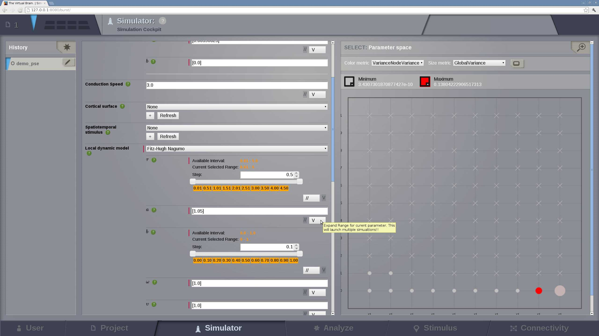

Tutorials and Examples
======================

Examples
---------

We present here some basic simulation scenarios that the user should be able to
reproduce through the |TVB| interface.

.. |example| image:: icons/applications-science.png

.. admonition:: |example| Example 1

    **Generating resting activity data using the default simulator configuration**

    **Objective**: generate 16 seconds of resting state activity data, sampled at 
    2048Hz, by launching a region-based simulation using a stochastic 
    integration method.

  #. Use the default long-range connectivity data.
  #. Apply a linear coupling function (parameters: rescale connection 
     strength=0.016, shift=0).
  #. Leave the *Cortical Surface* and the *Stimulus* set to **None**.
  #. Use the default population model and its parameters.
  #. Select the Heun Stochastic integrator. Integration step set to 
     :math:`dt=0.06103515625` and additive noise (with null correlation time 
     and an amplitude standard deviation :math:`D=2^{-10}`, use the default 
     random number generator parameters).
  #. Use the default model initial conditions (basically random initial 
     conditions).
  #. Select a Temporal Average Monitor (sampling period = 0.48828125 ms)
  #. Configure the portlets: select a Time Series Visualizer.
  #. Set the simulation length to 16000 ms
  #. Launch the simulation
  #. Observe the results: the default model state variable (membrane potential 
     in FitzHugh-Nagumo model).

  |

    Run time is approximately 4 minutes using one computing core of an Intel 
    Xeon Westemere 3.2 GHz, memory requirement < 1GB, data storage requirement
    ~ 19MB.

|

.. admonition:: |example| Example 2

    **Applying a stimulus on a region-based model**

    **Objective**: Create and apply a time-dependent stimulus to specific 
    region nodes.*

    #. Follow steps 1 and 2 from the previous example.
    #. Build the stimulus (See How to create a stimulus)
    #. Select a node from the 3D view on the left. Change its weight in the 
       'Current weight' cell.
    #. Press the 'Update weight' button.
    #. Do this for at least 5 nodes (assigning for instance 0.25, 0.15, 0.0625, 
       0.03125, 0.015625)
    #. Use a Gaussian for the temporal evolution of the stimulus (mean=15000 
       and standard deviation=4)
    #. Name the stimulus and press the 'Create the stimulus'
    #. Go back to the Burst Area and choose this specific stimulus into the 
       simulator.
    #. Follow steps 4 to 11 from the previous example.

|

Tutorials
----------

.. admonition:: Tutorial 1

  **Track Simulations History**

  **Objective**: track simulation history, select and store figures from results,
    visualize them. Selection of data on the basis of meta-data from the data 
    tree.

  *Requirements*: minimal data set in place (connectivity matrix, surface and 
  parcellation, nodes, fibre lengths).

    #. Set model family, parameters and generate network dynamics, as well as 
       EEG and fMRI signals.
    #. Visualize time series of all nodes (or subset) and their FFT (or subset).
    #. Choose scalar measure: pick a single frequency component from FFT. 
    #. Set parameters and generate network dynamics
    #. Repeat steps 2 through 4 multiple times as often as desired.

|

.. admonition:: Tutorial 2

  **Parameter Space Exploration**
  
  **Objective**: First, to run a batch job on the cluster or parallel processes in the
  local machine to compute. Second, to understand the parameter space display.

    #. Follow steps 1 to 3 from the Example 1.
    #. Click on the 'V' button next to the model parameters if you want to see
       the available parameter range and step size. At present, a maximum of 2
       parameters can be explored at the same time.
    #. Launch simulation
    #. Choose three points within the parameter space. Each parameter set is 
       represented by a scalar measure.
    #. A 2D discrete representation will be displayed on the right side of the 
       screen and it will be updated each time several simulations are finished.
    #. From those results, the most relevant set of parameters can be 
       distinguished. Choose three points and run longer simulations for those 
       parameter sets.
    #. For each set, run the simulation four times for different degrees of 
       noise.
    #. Save data. These data will now be analyzed.
    #. Generate cross correlation matrix and coherence across all EEG sensors 
       (or subset) and for fMRI signal across all regions (or subset).
    #. Visualize on EEG map (circular map à la LP plus surface à la SK) and 
       cross sections (fMRI).
    #. Analyze EEG data via PCA. Visualize results:

      a. Plot modes of principal components and eigenvalues
      b. FFT or time series

   

               
   Each point in this two dimensional graph represents two metrics: by default
   Global Variance corresponds to the size of the point and Variance of the
   Variance of nodes maps the color scale. 

|

.. admonition:: Tutorial 3

  **Perform a lesion**

  **Objective**: learn how to use the connectivity editor by lesioning the 
  connections between different brain regions.

    #. Go to the `Connectivity` --> `Long Range Connectivity` page.
    #. Launch the connectivity viewer. 
    #. Deselect the nodes you want lesion by clicking directly on the region 
       labels. This will remove all the incoming and ongoing connections into 
       and from those nodes.
    #. Hit the `Save Interest` button to save the new connectivity matrix.
    #. Press the `Refresh` button below the Connectivity Matrix field, to see 
       your new matrix. Select it.
    #. `Launch` the viewer again.
    #. Your new connectivity matrix should be displayed. The connection 
       strengths of the lesioned nodes are now set to 0.
  

|

.. admonition:: Tutorial 4

  **Generate a complex spatiotemporal stimulus**

  **Objective**: learn how to use the Stimulus editor.

    #. Go to `Stimulus` --> `Surface Stimulus` page.
    #. Enter a new name for the new `Surface Stimulus`.
    #. Choose the `Cortical Surface`.
    #. Select the equation that defines the spatial spread of the stimulus.
    #. Set the function parameters.
    #. Create the entity
