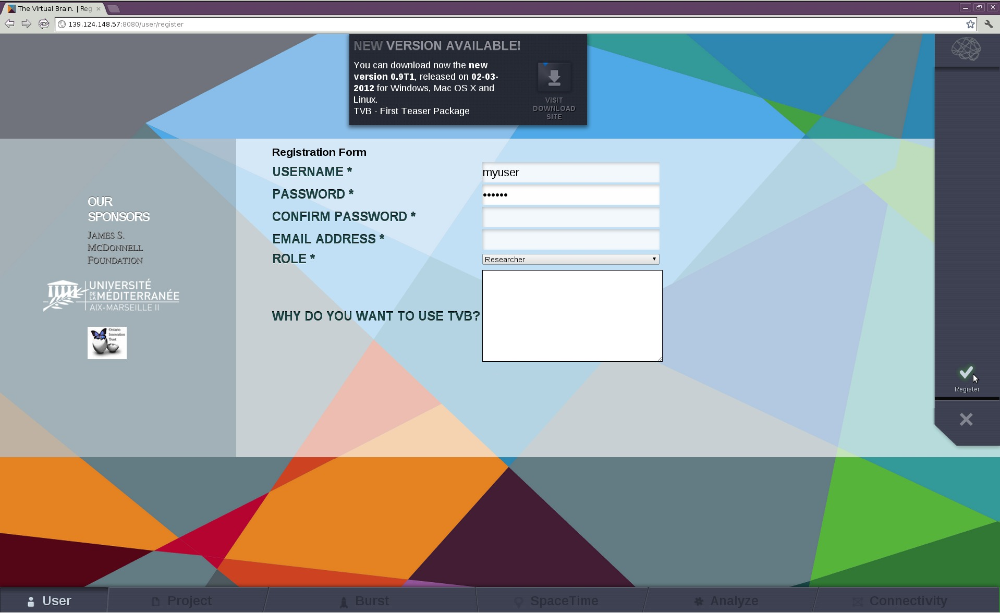
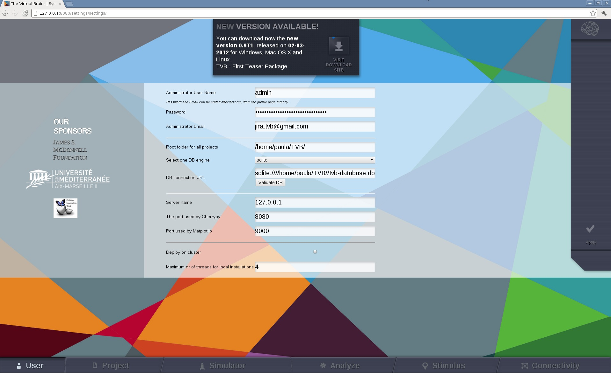

User Interface of |TVB|
=======================

Once started, |TVB| should automatically open your default browser and start on the
default `http://127.0.0.1:8080/settings/settings`. If not, you should manually open your favorite browser from our
list of supported browsers and open the before mentioned URL. This should open up the
following settings page:

.. figure:: screenshots/settings.jpg
   :width: 90%
   :align: center

   Settings Page

These are the configurable settings for |TVB|. Note that the `Name` of the administrator
is the only one that cannot be changed later on. The others will be accessible afterwards
from the profile page of the administrator. These settings are:

Administrator User Name:
	the name of the administrator.

Password:
	the password of the administrator. This can be changed later by clicking the
	`Change password` link from the profile page.

Administrator Email:
	the email of the administrator. Emails requesting validations for new users will
	be sent to this address. This can be changed by clicking the `edit` link from the
	profile page.

Root folder for all projects:
	this is the root storage for |TVB|. All your projects will be stored here, as well
	as the logging file and the files used as input and output for the backend server.
	Please provide here a valid folder path, on a drive which has enough space for storing TVB data.
	This field will be present on the settings page later on, but you won't be able to change it.
	In case you are forced to change this path/folder, we recoment that you export your 
	existing projects, stop |TVB|, start it with clean option (and configure new folder)
	then import your projects back in the system.

DB engine:
	currently supported are *sqlite* and *postgresql* databases. You will need to provide a
	valid database URL in case you choose postgresql. In the case of sqlite a default
	`tvb-database.db` will always be used. Please take into consideration that when
	switching to a new database **your existing data will be lost**.

Server name:
	usually the IP of the server that will run |TVB|. You can also leave it to the default
	if you are just running |TVB| locally.

Cherrypy port:
	the port used by cherrypy. You need to make sure this port is not used by some other
	application otherwise |TVB| will not start.

Matplotlib port:
	the port used by matplotlib. You need to make sure this port is not used by some other
	application otherwise some visualizers will not work.

Deploy on cluster:
	set true if you want to run |TVB| on a cluster environment.

RPC server:
	if you are not running on a cluster, this will be the port used by the backend server. If
	`Deploy on cluster` is checked this will not be used.

After selecting your desired settings press the `Apply` button. This will restart |TVB| with the
new settings. The restart could take a few minutes.

Register
--------

If you want to create a new user, you should `register` using the `new account
link` which gives the following form:

   |TVB| register page

.. .. note:: 
   
   The roles should not contain 'researcher/clinician' since clinicians can also
   do research but more specifically level of user 'basic/regular/advanced'

When the `register` button is clicked, an email is sent to `ADMINISTRATOR_EMAIL`
address. This is the administrator's task to validate the new account. The
administrator needs to be logged in to validate an account.

Login
-----

You can log into the platform once registered and validated or by using the
admin credentials you set in the `settings page`. Then, click on the `login` button on the
right of the page which will bring you to:

   The User Details page

Main Interface Description and Typical Workflow
-----------------------------------------------

On the right, the `login` button has changed to a `logout` button with obvious
functionality.

The main menu of |TVB| interface lays at the bottom of the page and is composed
of six basic options:

User:
    where user's details are managed.

Project:
    where projects are defined and administered.

Simulator:
    where simulations are launched, combined with the analyzers and visualiers. It allows to have quick overview of the ongoing Project.

Stimulus:
    where spatiotemporal stimuli can be generated.

Analyze:
    where experimental and simulated data can be analyzed.

Connectivity:
    where connectivity visualization and editing facilities of |TVB| are stored.

These options sum up the typical workflow within |TVB| framework which proceeds
through these steps:

1. a project is defined and/or selected and user data, e. g. a connectivity matrix, are uploaded into this project;

2. new data is obtained by simulating large scale brain dynamics with some set of parameters;

3. results are analyzed and visualized;

A history of launched simulations is kept to have the traceability of the different
modifications that took place in the simulation chain.

.. include:: UserGuide-UI_User.rst 

.. include:: UserGuide-UI_Project.rst

.. include:: UserGuide-UI_Burst.rst

.. include:: UserGuide-UI_Analyze.rst

.. include:: UserGuide-UI_Stimulus.rst

.. include:: UserGuide-UI_Connectivity.rst
