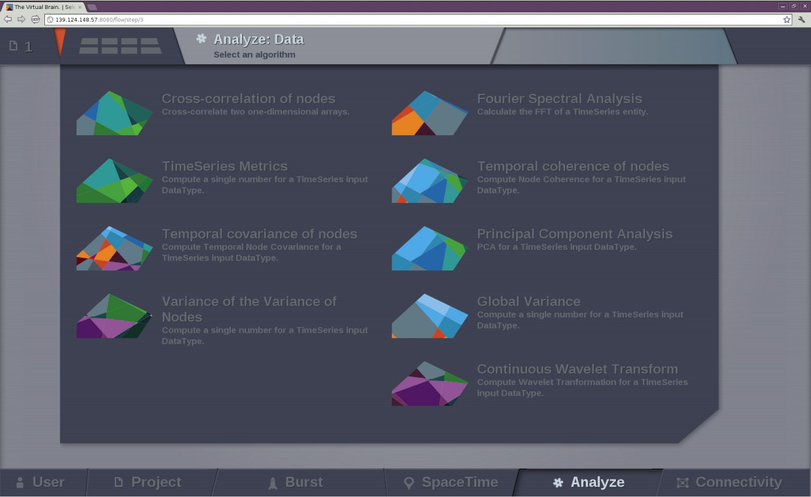

Analyze
-------

This area offers a set of techniques for data analysis.

   Current available analyzers

Brain Connectivity Toolbox Analyzers
....................................

If you have `matlab` or `octave` installed and available through the command 
line then all the algorithms offered by `Brain Connectivity Toolbox` (BCT) 
can be used directly from |TVB| interface and the results can later be displayed
in one of our visualizers.

Additional BCT techniques are:

    - Degree and Similarity Algorithms
    - Centrality Algorithms
    - Distance Algorithms
    - Modularity Algorithms
    - Clustering Algorithms
    - Density Algorithms

.. _BCT: https://sites.google.com/site/bctnet/

For more details, please refer to BCT_ web site 

