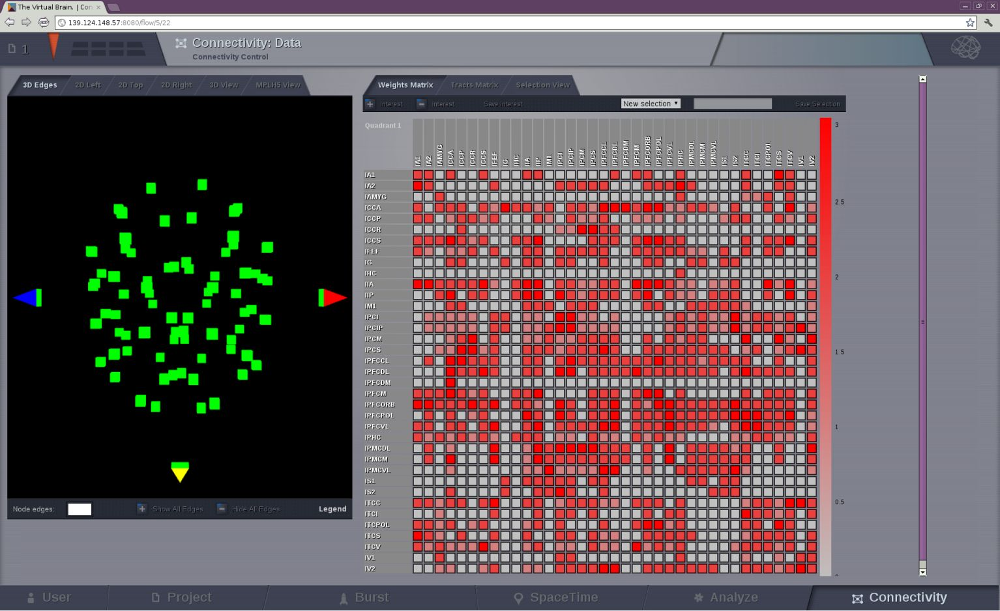

Connectivity Area
-----------------

In this area you can edit both types of TVB connectivity objects:

    - long-range connectivity and,
    - local connectivity.

    .. figure:: screenshots/connectivity_area.jpg
      :width: 90%
      :align: center

      Preview for Connectivity Area

Long Range Connectivity
.......................

From this page you can access one of |TVB| interactive tools: the connectivity
matrix editor.

Connectivity Matrix Editor
~~~~~~~~~~~~~~~~~~~~~~~~~~

On the left of the page you find a visualizer to you 

This 2D matrix representation allows you:
  - to easily edit the connectivity and the tract matrices, and
  - to save changes, i.e., create a modified version of your connectivity matrix
    that can be used in a new simulation.

We only display one quadrant of the matrix at a time. You can select which 
quadrant is shown on the 2D table by accesing the quadrant selector in the 
upper left corner of the matrix.

.. note:: 

    - quadrants 1 and 4 are the intra-hemisphere connectivity weights,
    - and quadrants 2 and 3 are the inter-hemisphere connectivity weights.

      .. figure:: screenshots/connectivity_quadrants.jpg
	:width: 50%
	:align: center

      Preview for Quadrant Selection

The Selection View tab on top of the connectivity matrix, labeled as *Weights
Matrix*, allows you to perform basic algebraic operations on a set of nodes.

In addition to that, you can specify the edge type, i.e., if the connection
strengths to be modified are going out or coming in from/to the selected nodes.

.. figure:: screenshots/connectivity3d_edges_operations.jpg
   :width: 90%
   :align: center

   Preview for Selection View

Available operations are:

- Assignation (set): assigns the given numeric value to all the nodes within 
  the set.
- Addition (add): adds the new value to the current value in the connectivity 
  matrix.
- Subtraction (decrease): subtracts the new value to the current value in the 
  connectivity matrix.
- Multiplication (multiply): multiplies the current value in the connectivity 
  matrix by the given numeric value.
- Division (divide): divides the current value in the connectivity matrix by 
  the given numeric value.

Hit the `Run` button to perform the selected operation.

By default the set includes all the nodes. You can deselect the nodes from the
node list. If you wish to save a particular selection, enter a new name and hit
the Save Selection button.

    .. figure:: screenshots/connectivity3d_newselection.jpg
      :width: 90%
      :align: center

      Preview for New Selection

|
|

Connectivity 3D Edges
~~~~~~~~~~~~~~~~~~~~~

This connectivity visualizer allows you to see the structural information as
base model part of TVB. On the left panel, the connectivity matrix is displayed
in 3D.

   Preview for Connectivity Viewer 3D Edges

The 3D semi-transparent surface arround the connectivity nodes, whether it is
the cortical surface or the outer-skin, is used just for giving space guidance.

You can select an individual node and righ-click on it to visualize the incoming
or outgoing edges. For each node you can choose a different color to apply to its
edges.

.. figure:: screenshots/connectivity3d_coloredges.jpg
   :width: 90%
   :align: center

   Preview for Connectivity Viewer 3D Edges - Coloring incoming / outgoing edges

Connectivty 3D View
~~~~~~~~~~~~~~~~~~~

A 3D representation of the connectivity matrix. (WebGL)
Two specific node-measures can be displayed here by gradient colors and
different node sizes.

    .. figure:: screenshots/connectivity3d.jpg
      :width: 30%
      :align: center

      Preview for Connectivity 3D Viewer
 

Connectivity 2D Viewer
~~~~~~~~~~~~~~~~~~~~~~

A 2D representation of the connectivity matrix. 
There are three main views:
 
  - 2D Left
  - 2D Top
  - 2D Right

.. figure:: screenshots/connectivity2d_left.jpg
   :width: 30%
   :align: left

.. figure:: screenshots/connectivity2d_top.jpg
   :width: 30%
   :align: center

.. figure:: screenshots/connectivity2d_right.jpg
   :width: 30%
   :align: right

   Preview for Connectivity 2D Viewer

Matrix  MPLH5 View
~~~~~~~~~~~~~~~~~~

A 2D representation of the connectivity matrix (matplotlib). 
Here, the the complete connectivity matrix is displayed. 

.. figure:: screenshots/connectivity_mplh5.jpg
   :width: 30%
   :align: right
   
   Preview for Matrix Display

Local Connectivity
..................

In this page, you can generate the spatial profile of local connectivity that 
will be used in surface-based simulations.

    .. figure:: screenshots/connectivity_local.jpg
      :width: 90%
      :align: center

    Local Connectivity editing page

On the lower right of the browser you will have access to different 
functionalities by clicking on:

    - `Create Local Connectivity` button: to generate the Local Connectivity entity.

    - `View Local Connectivity` button: to launch a 3D brain visualizer displaying the spatial profile of the newly generated entity.

	.. figure:: screenshots/local_connectivity_viewer.jpg
	  :width: 70%
	  :align: center

	Local Connectivity Viewer

    - `Edit Local Connectivity` button: to go back to the main Local Connectivity editing page.

 
 