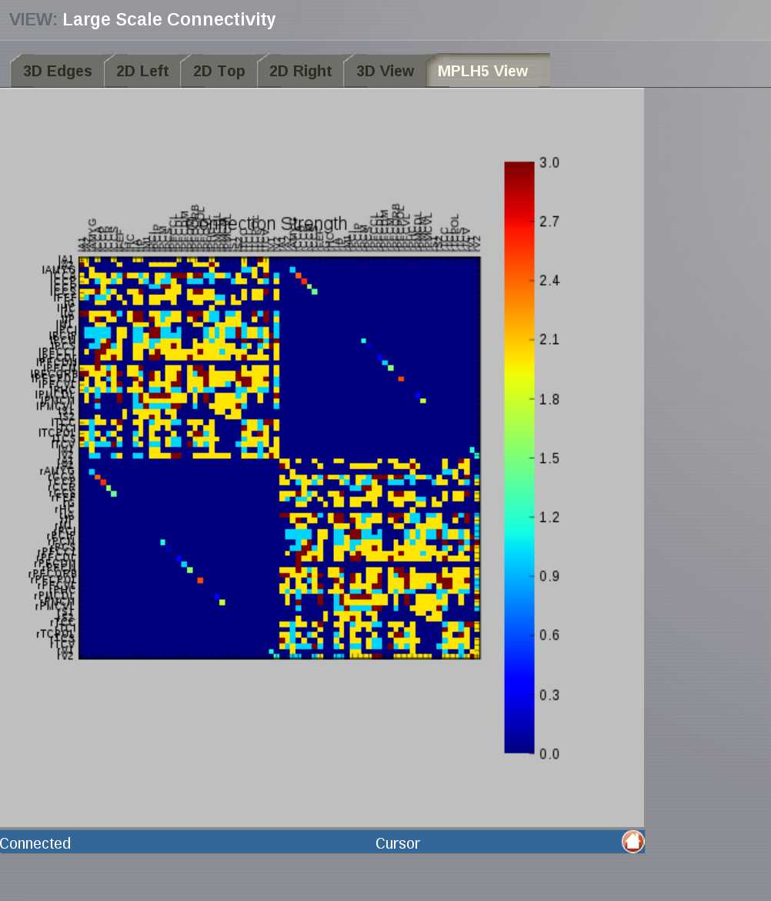

Connectivity Area
-----------------

In this area you can edit both types of TVB connectivity objects:

    - long-range connectivity and,
    - local connectivity.

    .. figure:: screenshots/connectivity_area.jpg
      :width: 90%
      :align: center

      Preview for Connectivity Area

Long Range Connectivity
.......................

Connectivity 3D Edges
~~~~~~~~~~~~~~~~~~~~~

This connectivity visualizer allows you to see the structural information as
base model part of TVB. On the left panel, the connectivity matrix is displayed
in 3D.

.. figure:: screenshots/connectivity.jpg
   :width: 90%
   :align: center

   Preview for Connectivity Viewer 3D Edges

The 3D semi-transparent surface arround the connectivity nodes, whether it is
the cortical surface or the outer-skin, is used just for giving space guidance.

You can select an individual node and righ-click on it to visualize the incoming
or outgoing edges. For each node you can choose a different color to apply to its
edges.

.. figure:: screenshots/connectivity3d_coloredges.jpg
   :width: 90%
   :align: center

   Preview for Connectivity Viewer 3D Edges - Coloring incoming / outgoing edges

Connectivty 3D View
~~~~~~~~~~~~~~~~~~~

A 3D (WebGL) representation of the connectivity matrix.
Two specific node-measures can be displayed here by node gradient colors and
different node sizes.

.. figure:: screenshots/connectivity3d.jpg
   :width: 90%
   :align: center

   Preview for Connectivity 3D Viewer
 

Connectivity 2D Viewer
......................

A 2D representation of the connectivity matrix.

One can select node-by-node in the connectivity, to emphasize connections
between nodes and strength. Views are 2D Left, 2D Top and 2D Right.

.. figure:: screenshots/connectivity2d_left.jpg
   :width: 30%
   :align: left

.. figure:: screenshots/connectivity2d_top.jpg
   :width: 30%
   :align: center

.. figure:: screenshots/connectivity2d_right.jpg
   :width: 30%
   :align: right

   Preview for Connectivity 2D Viewer

Connectivity Matrix Editor
~~~~~~~~~~~~~~~~~~~~~~~~~~

On the right of every Connectivity display, a 2D table is also available for
easily editing the connectivity and the tract matrix, e.g., perform lesions and
save changes for a compared simulation.

You can select the quadrant to be displayed on the 2D table by accesing the
quadrant selector on the upper left corner of the matrix:

- quadrants 1 and 4 are the intra-hemisphere connectivity weights,

- and quadrants 2 and 3 are the inter-hemisphere connectivity weights.

.. figure:: screenshots/connectivity_quadrants.jpg
   :width: 90%
   :align: center

   Preview for Quadrant Selection

The Selection View tab on top of the connectivity matrix, labeled as *Weights
Matrix*, allows you to perform basic algebraic operations on a set of nodes.
In addition to that, you can specify the edge type, i.e., if the connection
strengths to be modified are going out or coming in from/to the selected nodes.

.. figure:: screenshots/connectivity3d_edges_operations.jpg
   :width: 90%
   :align: center

   Preview for Selection View

The operations are:
	- Assignation (set): assigns the given numeric value to all the nodes within the set.
	- Addition (add): adds the new value to the current value in the connectivity matrix.
	- Subtraction (decrease): subtracts the new value to the current value in the connectivity matrix.
	- Multiplication (multiply): multiplies the current value in the connectivity matrix by the given numeric value.
	- Division (divide): divides the current value in the connectivity matrix by the given numeric value.

Hit the `Run` button to perform the selected operation.

By default the set includes all the nodes. You can deselect the nodes from the
node list. If you wish to save a particular selection, enter a new name and hit
the Save Selection button.

.. figure:: screenshots/connectivity3d_newselection.jpg
   :width: 90%
   :align: center

   Preview for New Selection

Matrix  MPLH5 View
~~~~~~~~~~~~~~~~~~

A 2D (matplotlib) representation of the connectivity matrix. Here, the four
quadrants of the weights matrix can be observed.

   Preview for Matrix Display

Local Connectivity
..................

In this page, you can generate the spatial profile of local connectivity that 
will be used in surface-based simulations.

    .. figure:: screenshots/connectivity_local.jpg
      :width: 90%
      :align: center

    Local Connectivity editing page

Required fields:

    - `Surface` : the spatial support
    - `Spatial` : the local connectivity function
    - `Cuttof distance`: distance at which the evaluation of the spatial function is truncated.
    - `Display name`: user defined name for the new local connectivity entity

On the lower right of the browser you have will access to different 
functionalities by clicking on:

    - `Create Local Connectivity` button: to generate the Local Connectivity entity.

    - `View Local Connectivity` button: to launch a 3D brain visualizer displaying the spatial profile of the newly generated entity.

	.. figure:: screenshots/local_connectivity_viewer.jpg
	  :width: 70%
	  :align: center

	Local Connectivity Viewer

    - `Edit Local Connectivity` button: to go back to the main Local Connectivity editing page.

.. admonition:: Important

    .. image:: screenshots/important.png
	:align: left
    
    Surfaces with more vertices than 256 x 256 x 256 are filtered out from Model 
    Parameters settings at the surface level, because the algorithm for vertices 
    picking only has that many colors to use. 

    We are planning, for the long-term, to have in |TVB| a surface shrinkage 
    algorithm. Given a large surface, a smaller one will be built to meet the 
    requirements for |TVB|. 

 
 