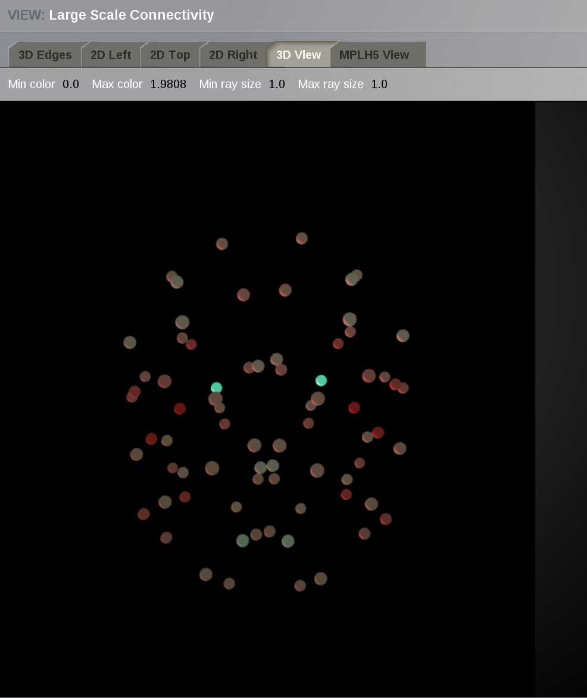

Connectivity
------------

In this area you can edit both types of TVB connectivity objects:

    - long-range connectivity and,
    - local connectivity.
    
|

    .. figure:: screenshots/connectivity_area.jpg
      :width: 90%
      :align: center

      Preview for Connectivity Area

Long Range Connectivity
.......................

    .. figure:: screenshots/connectivity_large_scale.jpg
       :width: 90%
       :align: center

       Large Scale Connectivity configuration page

From this page you can access: 

  - an interactive display tool on the `Control` right column and 
  - several Long Range Connectivity visualizations on the left `View` column.

      - 3D Views

	- Edges
	- Nodes

      - 2D Projections

	- Left
	- Right
	- Top

      - a MPLH5 matrix plot

Connectivity Matrix Editor
~~~~~~~~~~~~~~~~~~~~~~~~~~

.. figure:: screenshots/connectivity_editor.jpg
   :width: 90%
   :align: center

   Preview for the Matrix Editor

From the this 2D display allows you to:

  - easily edit the connectivity (tract lengths) matrix, and
  - create a modified version of your connectivity matrix
  - select a small subset of nodes
    - perform basic algebraic operations on that group
  - save all changes to use the new Connectivity object in a simulation.

.. hint:: 

    In the Matrix Editor only one quadrant is displayed at a time.
    You can select which quadrant is shown by accessing the quadrant selector 
    button in the upper left corner of the matrix display.
     
    - quadrants 1 and 4 are the intra-hemisphere connectivity weights,
    - and quadrants 2 and 3 are the inter-hemisphere connectivity weights.

      .. figure:: screenshots/connectivity_quadrants.jpg
	:width: 50%
	:align: center

      Preview for Quadrant Selection

The **Weights** button opens a menu that allows you to perform basic algebraic 
operations on a set of selected nodes specifying the edge type:

    - Incoming --> Incoming
    - Incoming --> Outgoing
    - Outgoing --> Incoming
    - Outgoing --> Outgoing

.. i.e., if the connection strengths to be modified are going out or coming in from/to the selected nodes.

|

.. figure:: screenshots/connectivity3d_edges_operations.jpg
   :width: 90%
   :align: center

   Preview for Operations on a selection of nodes

.. note:: 
  Available operations are:

  - Assignation (set): assigns the given numeric value to all the nodes within 
    the set.
  - Addition (add): adds the new value to the current value in the connectivity 
    matrix.
  - Subtraction (decrease): subtracts the new value to the current value in the 
    connectivity matrix.
  - Multiplication (multiply): multiplies the current value in the connectivity 
    matrix by the given numeric value.
  - Division (divide): divides the current value in the connectivity matrix by 
    the given numeric value.

Click on the `Apply weight change` button to perform the selected operation.

.. note::

    TVB is designed to handle connectivity matrices whose values are:
    
      - positive real values, meaning that there is a connection, or
      - zero values, meaning the absence of a connection

.. warning:: 

      - TVB does not handle unknowns such as NaNs or Infs.

      - If your connectivity matrix contains negative values, such as -1 values
        you should either set these values to zero or an estimated value based 
        on your research assumptions. 
 

By default the set includes all the available nodes in the connectivity matrix. 

    .. figure:: screenshots/connectivity3d_newselection.jpg
      :width: 90%
      :align: center

      Preview for New Selection

You can create a smaller selection by clicking on the `Quick-select` button and
editing the list of node names. 

.. figure:: screenshots/connectivity_quick_select.jpg
   :width: 90%
   :align: center

   Preview for `Quick-select` list

.. |savetick| image:: icons/save_tick.png

TVB enables you to save:
 
  - a particular selection by entering a name and clicking on |savetick| or,
  - a new `Connectivity` object by clicking on |staricon|. This entity can be 
    used later on in |TVB| `Simulator`.

|
|

Viewers
~~~~~~~

Connectivity 3D Edges
~~~~~~~~~~~~~~~~~~~~~

This connectivity visualizer allows you to see the structural information as a
base model part of TVB. 

.. figure:: screenshots/connectivity3d.jpg
   :width: 50%
   :align: center

   Preview for Connectivity Viewer 3D Edges

The 3D semi-transparent surface arround the connectivity nodes, whether it is
the cortical surface or the outer-skin, is used just for giving space guidance.

You can select an individual node and right-click on it to activate the incoming
or outgoing edges. 

For each node you can choose a different color to apply to its
edges.

.. figure:: screenshots/connectivity3d_coloredges.jpg
   :width: 50%
   :align: center

   Preview for Connectivity Viewer 3D Edges - Coloring incoming / outgoing edges

|
|

Connectivty 3D Nodes
~~~~~~~~~~~~~~~~~~~~

A 3D representation of the connectivity matrix nodes. (WebGL)

Two specific connectivity node-metrics, (previously computed using one of BCT 
analyzers) can be used to independently set: 
  
  - the node color and
  - the node size. 

   Preview for Connectivity 3D Viewer
 

|
|

Connectivity 2D Viewer
~~~~~~~~~~~~~~~~~~~~~~

A 2D representation of the connectivity matrix nodes and edges. 

There are three main views (projections):
 
  - Left sagittal view
  - Transverse view
  - Right sagittal view

.. figure:: screenshots/connectivity2d_left.jpg
   :width: 50%
   :align: center

.. figure:: screenshots/connectivity2d_top.jpg
   :width: 50%
   :align: center

.. figure:: screenshots/connectivity2d_right.jpg
   :width: 50%
   :align: center

   Preview for Connectivity 2D Viewer

|

The node size can be defined using a ConnectivityMeasure datatype 
(e.g. the output of a BCT Anlayzer). Additionally, a threshold can be set for 
the node color. The nodes with values above the threshold will be red and those
whose value are below the threshold will be yellow.

To display the changes, click on the `Show details` button.

.. figure:: screenshots/connectivity2d_left_metrics.jpg
   :width: 50%
   :align: center
   
   Preview of 2D Connectivity Viewer (left lateral view). Node size is defined
   by the Participation Coefficient. Color threshold is 1.8; this values is based 
   on the the Clustering Coefficient (BU) of the default Connectivity matrix.

.. tip::

    If you wish to change: 

                            - the color threshold,
                            - the metrics used to define the node features,
                            - the colormap used in the Connectivity Matrix Editor, or
                            - the Connectivity entity

   go to the `brain` menu on the top right corner
   
   .. figure:: screenshots/connectivity_context_menu.jpg
      :width: 50%
      :align: center

|
|

Matrix Overview
~~~~~~~~~~~~~~~~

A 2D matrix plot to have a complete overview of the initially selected weighted
connectivity matrix.

.. figure:: screenshots/connectivity_mplh5.jpg
   :width: 50%
   :align: center
   
   Preview for Matrix Overview display

Local Connectivity
..................

In this page, you can generate the spatial profile of local connectivity that 
will be used in surface-based simulations.

    .. figure:: screenshots/connectivity_local.jpg
      :width: 90%
      :align: center

    Local Connectivity editing page

On the lower right of the browser you will have access to different 
functionalities by clicking on:

    - `Create new Local Connectivity` button: to generate the Local Connectivity entity.

    - `View Local Connectivity` button: to launch a 3D brain visualizer displaying the spatial profile of the newly generated entity.

	.. figure:: screenshots/local_connectivity_viewer.jpg
	  :width: 70%
	  :align: center

	Local Connectivity Viewer

    - `Edit Local Connectivity` button: to go back to the main Local Connectivity editing page.

On the right column there is a display showing different estimations of the 
spatial profile based on the length of :

  - Theoretical case: is the ideal case.
  - Most probable case: resolution is based on the mean length of the edges of the surface mesh. 
  - Worst case: resolution is based on the longest edge in the surface mesh.
  - Best case: resolution is based on the shortest edge in the surface mesh.

      .. figure:: screenshots/local_connectivity_estimations.jpg
	 :width: 70%
         :align: center 

         Local connectivity profile estimations.

and the red-dotted vertical line represents the cut-off distance. 

The x-axis range is automatically set to two times the cut-off distance.
