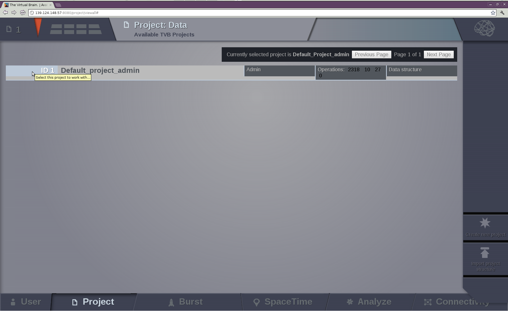
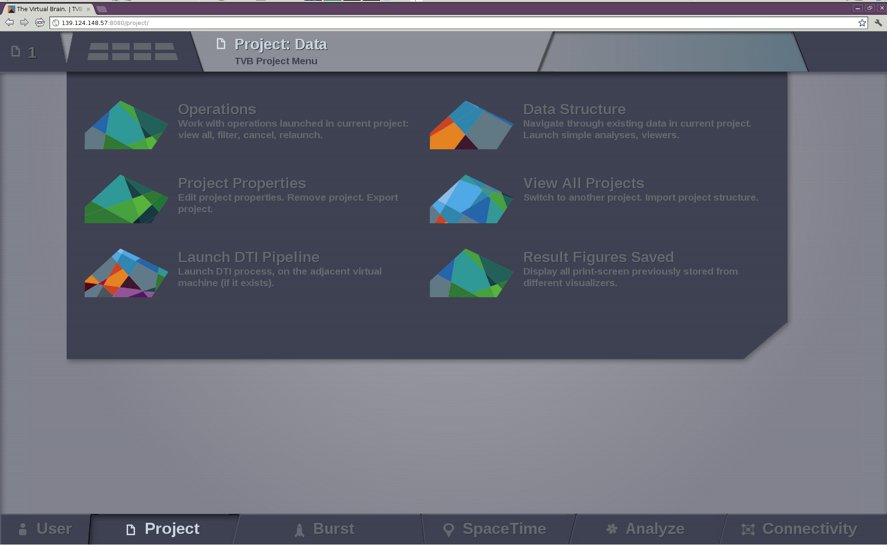
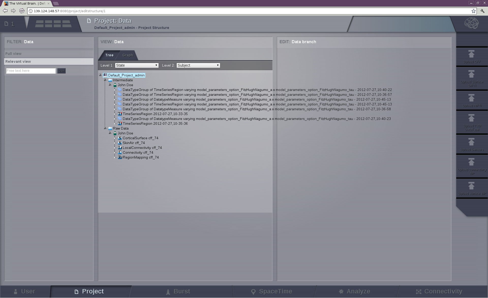
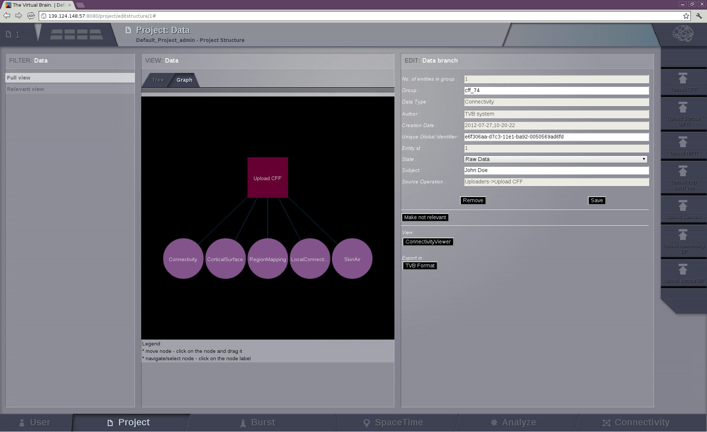

Project Area
------------

Data and simulations are organized within projects. They correspond to
directories where related data sets and simulation results are stored.

When the `Project` option is selected you should have the default project created
for you on user registration:

   The default `Project`

You can edit this by clicking on the `Project Properties` option which leads to the project's form (this form is also reached by clicking the
`Create New Project` button in the `View All Projects` option):

.. figure:: screenshots/project_form.png
   :width: 90%
   :align: center

   The project form

where a project name (*without spaces*) should be chosen/edited and a short description should be given.
When other users are registered in the framework, you can choose to
share the project with other users by checking their respective 'Visible for' boxes.
Then Save changes (button located on the right side), to get back to the page where
projects can be selected; the new project is now present:

.. figure:: screenshots/project_select.png
   :width: 90%
   :align: center

   The project selection and adminstration page.

Projects are selected using their **id** on the left column. Once a project is
selected, you can get information on your project by pointing to the upper left corner of
the interface:

.. figure:: screenshots/project_info.png
   :width: 90%
   :align: center

   The main information about the selected project. 

To navigate through the `Project` area, there is a second level
menu in the top left corner, next to the Project number.

   The `Project` area

This area consists of:

- Operations: to browse the history of operations related to the project.A table with the current
  project operations is displayed. From this board the user can filter, view, reload or
  cancel any operation.

.. figure:: screenshots/default_operations.png
   :width: 90%
   :align: center

   The operation page with default operations

	- Project Properties: to edit current project properties, export or remove the project.
  
	- Data Structure: to navigate through the existent data in the current project. Analysis and Visualizers can be launched from this area. It allows to edit	the structure of the data storage. On the right,`upload` buttons appear	for each type of TVB-compatible data. 
	
		- Upload CFF: connectome format
		- Upload Surface GIFTI
		- Upload NIFTI
		- Upload TVB DataType
		- Upload Sensors
		- Upload Connectivity
		- Upload Surface

   The data structure of our project with default data.

   The description of the data appear when they are selected.

	- View all Projects: to switch to another project or import a previously saved project.

	- Saved Figures: to display all the print-screens from visualizations.

	- DTI Pipeline: if the proper virtual machine exists, a DTI pipeline can be launched in order obtain a connectivity matrix from DTI data. 

