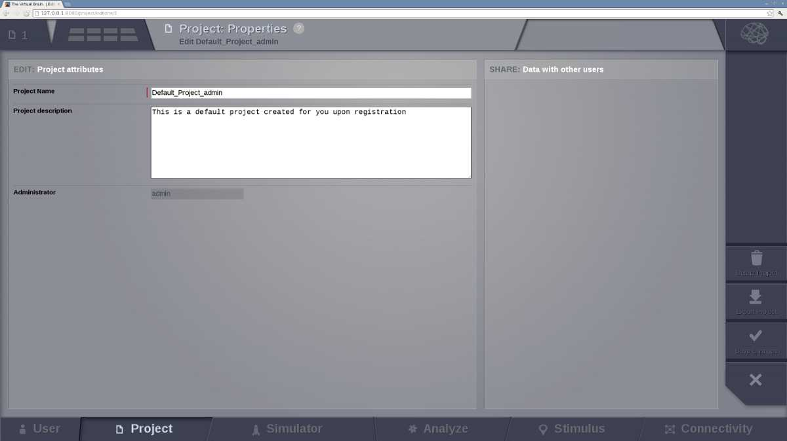
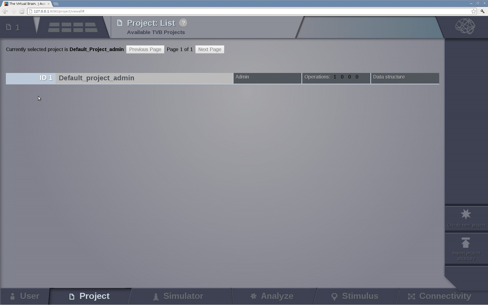

Project Area
------------

Gives acces to the projects structure and properties.

Data and simulations are organized within projects. They correspond to
directories where related data sets and simulation results are stored.

Upon first user registration, when the `Project` option tab is selected you should have the default project created
for you:

.. figure:: screenshots/default_project.jpg
   :width: 90%
   :align: center

   The default `Project`

In general, to navigate through the `Project` area there is a second level
menu in the top left corner, next to the Project number.

.. figure:: screenshots/project_area.jpg
   :width: 90%
   :align: center

   The `Project` area

If you wish to edit the project properties, click on the second level menu and then select `Project Properties`  which leads to the project's form (this form is also reached by clicking the `Create New Project` button in the `View All Projects` option):

   The `Project Properties` option.

   The project form where a project name (*without spaces*) should be defined and a short description should be given.

When other users are registered in the framework, you can choose to 
share the project with other users by checking their respective 'Visible for' boxes.
Then save changes by clicking on the `Save` button located on the right side and to get back to the page where
projects can be selected; the new project is now present:

   The project selection and adminstration page.

Projects are selected using their **id** on the left column. Once a project is
selected, you can get information on your project by pointing to the upper left corner of
the interface:

.. figure:: screenshots/project_info.jpg
   :width: 90%
   :align: center

   The main information about the selected project. 

The other `Project` options are:

- `Operations`: to browse the history of operations related to the project. A table with the current
  project operations is displayed. From this board the user can filter, view, reload or
  cancel any operation.

.. figure:: screenshots/default_operations.jpg
   :width: 90%
   :align: center

   The operation page with default operations

- `Project Properties`: to edit current project properties, export or remove the project.
  
- `Data Structure`: to navigate through the existent data in the current project. 

.. figure:: screenshots/data.jpg
   :width: 90%
   :align: center

   The data structure of our project with default data.

The user can edit metadata, launch `Analyzers` and `Visualizers`, link data to other projects and export data. can be launched from this area. It allows to edit the structure of the data storage. On the right,`upload` buttons appear for each type of TVB-compatible data.

.. figure:: screenshots/data_overlay.jpg
   :width: 90%
   :align: center

From this area, you can upload different data types and/or structures such as:

* CFF connectome format
* Surface GIFTI
* TimeSeries GIFTI
* NIFTI
* RegionMapping
* TVB DataType
* Sensors
* Connectivity (zip)
* Upload Surface (zip)

.. figure:: screenshots/data_uploaders.jpg
   :width: 90%
   :align: center

   Available uploaders

.. figure:: screenshots/data_description.jpg
   :width: 90%
   :align: center

   The description of the data appear when they are selected.

- `View all Projects`: to switch to another project or import a previously saved project.

- `Saved Figures`: to display all the print-screens from visualizations.

- `DTI Pipeline`: if the proper virtual machine exists, a DTI pipeline can be launched in order obtain a connectivity matrix from DTI data. 