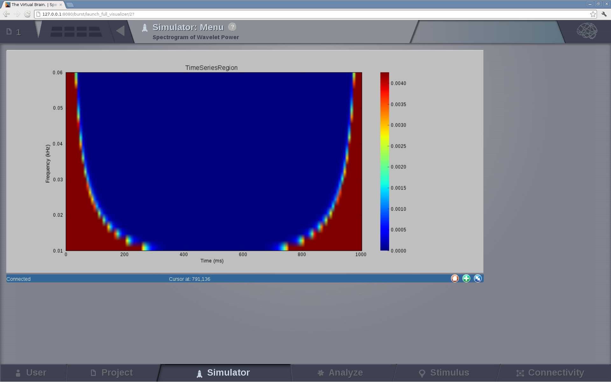

.. VISUALIZERS COLUMN

.. hint::
    By clicking on `Launch full visualizer` button of each window, you will be 
    redirected to a new page where the full figure is displayed. In this new 
    page, you can click the `brain` icon on the top right corner to access a 
    new menu which will allow you to:

      - `Save` a snapshot of the current figure,
      - `Relaunch` the operation.

      .. figure:: screenshots/visualizer_save_figure.jpg
	  :width: 90%
	  :align: center
            
	  The main information about the selected project.

    All saved figures can be displayed in Projects --> Saved Figures page.

Next, we provide a brief description the visuzalizers that can be configured in
the portlet tabs.

Brain Activity Visualizer
.........................

A 3D visualization of the brain activity based on WebGL.

It displays the activity at the surface level (fine granularity - each surface 
vertex has an individual measure) or at the region level (coarse-granularity - 
each region is represented with only one color).

.. figure:: screenshots/brain.jpg
   :width: 90%
   :align: center

   Preview for Brain Activity Visualizer

Covariance Visualizer
.....................

.. figure:: screenshots/visualizer_covariance.jpg
   :width: 90%
   :align: center

   Preview for Covariance Visualizer

Cross Coherence Visualizer
...........................

.. figure:: screenshots/visualizer_cross_coherence.jpg
   :width: 90%
   :align: center

   Preview for Cross Coherence Visualizer

Cross Correlation Visualizer
............................

This visualizer is the same as the `Covariance` display, meaning that it displays a matrix.

Fourier Spectrum Visualizer
...........................

.. figure:: screenshots/visualizer_fft.jpg
   :width: 90%
   :align: center

   Preview for Fourier Spectrum Visualizer

Principal Component Visualizer
..............................

.. figure:: screenshots/analyzers_pca.jpg
   :width: 90%
   :align: center

   Preview for Principal Components Analysis Visualizer

Time Series Visualizer
......................

.. figure:: screenshots/visualizer_timeseries_svgd3.jpg
   :width: 90%
   :align: center

   Preview for Time-Series Visualizer

Wavelet Spectrogram Visualizer
..............................

   Preview for Wavelet Visualizer