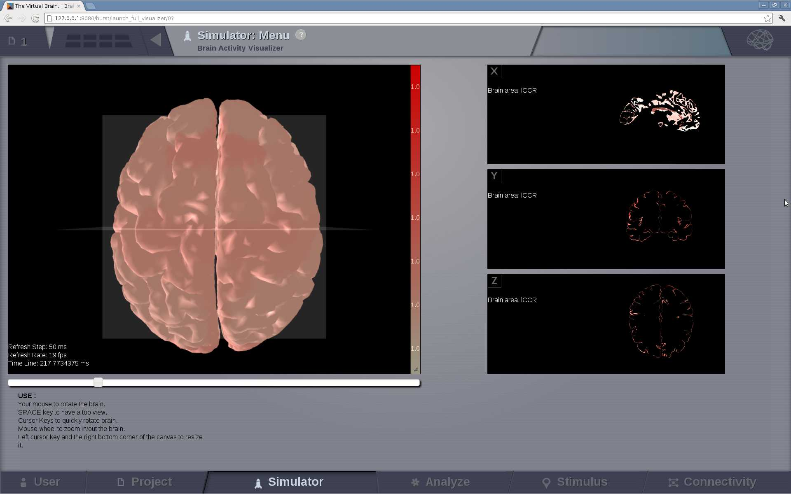
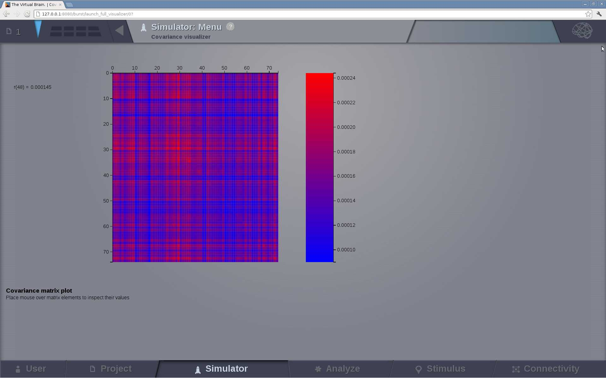
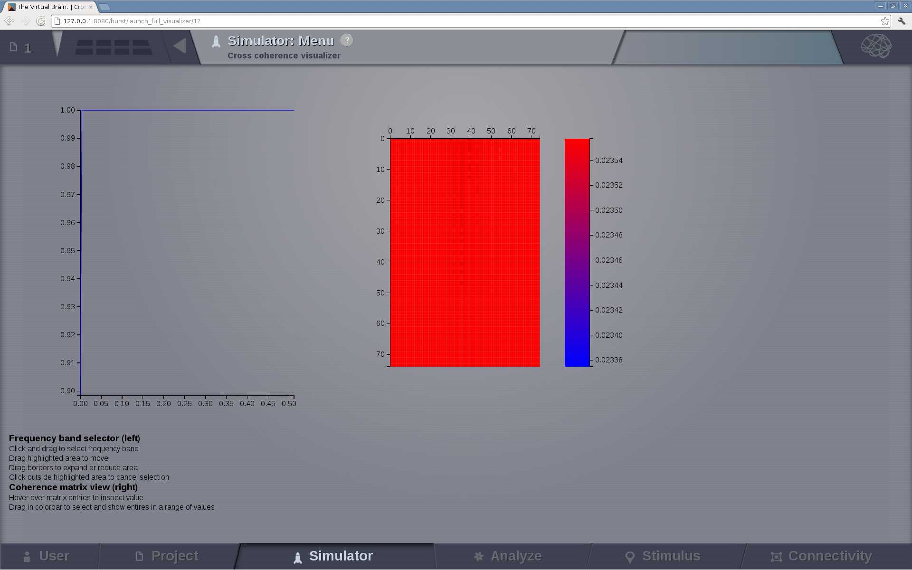
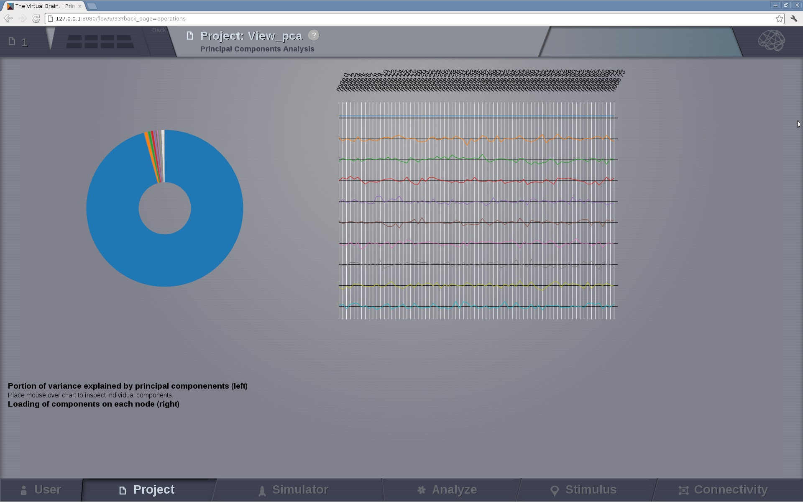
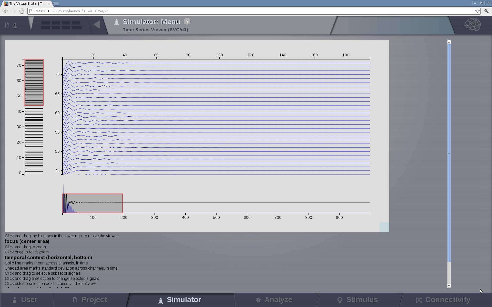

.. VISUALIZERS COLUMN
.. should be a file    
.. UserGuide-UI_Simulator-Visualizers.rst ---> explain the View column in `Simulator`
.. UserGuide-UI_Visualizers.rst ---> all visualizers? 

A brief description of some available visualizers in the `View` column of the `Simulator` Area. Maximize this column by clicking
on the icon located on its top right corner.

Up to 4 visualizers per `View` tab can be configured. 

Brain Activity Visualizer
.........................

A 3D visualization of the brain activity based on WebGL.

It displays the activity at the surface level (fine granularity - each surface vertex has an individual measure) or at the region level (coarse-granularity - each region is represented with only one color).

   Preview for Brain Activity Visualizer

Covariance Visualizer
.....................

   Preview for Covariance Visualizer

Cross Coherence Visualizer
...........................

   Preview for Cross Coherence Visualizer

Cross Correlation Visualizer
............................

This visualizer is the same as the `Covariance` display, meaning that it displays a matrix.

Fourier Spectrum Visualizer
...........................

.. figure:: screenshots/visualizer_fft.jpg
   :width: 90%
   :align: center

   Preview for Fourier Spectrum Visualizer

Principal Component Visualizer
..............................

   Preview for Principal Components Analysis Visualizer

Time Series Visualizer
......................

   Preview for Time-Series Visualizer

Wavelet Spectrogram Visualizer
..............................

