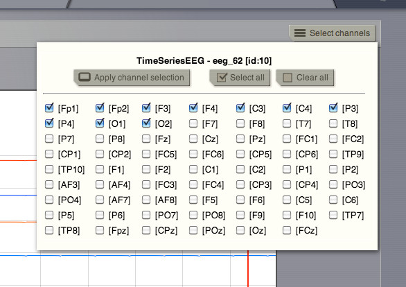
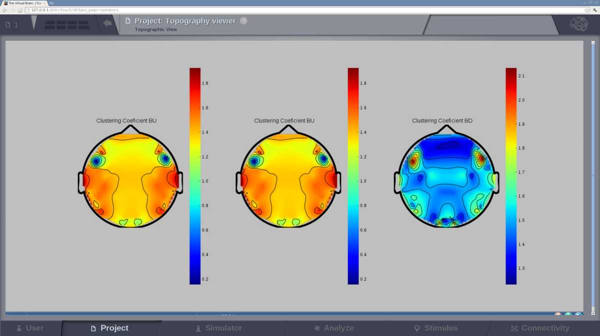

.. VISUALIZERS COLUMN

Simple Visualizers
..................

Brain Activity Visualizer
~~~~~~~~~~~~~~~~~~~~~~~~~

A 3D scene of the brain activity:

- at the region level: the brain is represented by a coarse granularity - each 
  region is represented with only one color.

.. figure:: screenshots/brain.jpg
   :width: 90%
   :align: center

   Preview for Brain Activity Visualizer at the region level

- at the surface level: the brain is represented by a fine granularity - each 
  surface vertex has an individual measure.

Time Series Visualizer (svg/d3)
~~~~~~~~~~~~~~~~~~~~~~~~~~~~~~~

.. figure:: screenshots/visualizer_timeseries_svgd3.jpg
   :width: 90%
   :align: center

   Preview for Time-Series Visualizer (svg/d3)

Time Series Visualizer (mplh5)
~~~~~~~~~~~~~~~~~~~~~~~~~~~~~~

.. figure:: screenshots/visualizer_timeseries_mplh5.jpg
   :width: 90%
   :align: center

   Preview for Time Series Visualizer (mplh5)

EEG Time Series Visualizer
~~~~~~~~~~~~~~~~~~~~~~~~~~

.. figure:: screenshots/visualizer_timeseries_eeg.jpg
   :width: 90%
   :align: center

   Preview for EEG Time Series Visualizer

If you used an EEG monitor to record the activity of your large-scale brain 
simulation, this display allows you to select the channels of the 62-sensors 
EEG recording. 

   Selecting the "channels" to be displayed.
   
   
Dual Brain - EEG Visualizer
~~~~~~~~~~~~~~~~~~~~~~~~~~~

.. figure:: screenshots/visualizer_timeseries_eeg.jpg
   :width: 90%
   :align: center

   Preview for EEG Time Series Visualizer

This visualizer combines the brain activity on top of a 3D display of the pacient's 
head and on the right column, the EEG channels recordings. Channel selection is 
also available.

.. figure:: screenshots/visualizer_dual_head_eeg.jpg
   :width: 90%
   :align: center

   Brain activity wit EEG recordings.

Analyzers + Visualizers
.......................

Covariance Visualizer
~~~~~~~~~~~~~~~~~~~~~~

Displays the covariance matrix. 
The matrix size is `number of nodes` x `number of nodes`

.. figure:: screenshots/visualizer_covariance.jpg
   :width: 90%
   :align: center

   Preview for Covariance Visualizer

Cross Coherence Visualizer
~~~~~~~~~~~~~~~~~~~~~~~~~~~

Displays the cross-coherence matrix. Axes represent brain nodes.
The matrix size is `number of nodes` x `number of nodes`

 
.. figure:: screenshots/visualizer_cross_coherence.jpg
   :width: 90%
   :align: center

   Preview for Cross Coherence Visualizer

Cross Correlation Visualizer
~~~~~~~~~~~~~~~~~~~~~~~~~~~~

Displays the cross-correlation matrix. Similar to the previous
two visualizers.

Fourier Spectrum Visualizer
~~~~~~~~~~~~~~~~~~~~~~~~~~~

Plots the power spectrum of each node time-series.

.. figure:: screenshots/visualizer_fft.jpg
   :width: 90%
   :align: center

   Preview for Fourier Spectrum Visualizer

Principal Component Visualizer
~~~~~~~~~~~~~~~~~~~~~~~~~~~~~~

On the left, the ring plot displays the fraction of the variance that is 
explained by each component.

On the right, the first ten components are plotted against the brain nodes 
(variables). 

   Preview for Principal Components Analysis Visualizer

Wavelet Spectrogram Visualizer
~~~~~~~~~~~~~~~~~~~~~~~~~~~~~~~

2D representation that shows how the signals wavelet spectral coefficients (frequency) 
variy with time.

.. figure:: screenshots/visualizer_wavelet.jpg
   :width: 90%
   :align: center

   Preview for Wavelet Visualizer

Topographic Visualizer
~~~~~~~~~~~~~~~~~~~~~~

   Preview for Topographic Visualizer

This display is available for ConnectivityMeasure datatypes obtained by means of
a BCT analyzer. 
