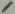

Simulator
---------

A configurable multicolumn interface that combines |TVB| simulation, analysis 
and visualization capabilities.

    .. figure:: screenshots/simulator.jpg
      :width: 90%
      :align: center

      Preview for Simulator Area

.. SIMULATOR COLUMN

Configure a Simulation
.......................

|

On the top of this column there is:
  - a field to enter the new simulation name,
  - the `Launch` button on the top right to start the simulation, and
  - the `Configure Interface` button to select which of the simulation 
    components are visible.

|

    .. image:: screenshots/simulator_configuration_buttons.jpg
       :width: 90%
       :align: center

|

Via this column, you have access to all the simulator components configurable 
settings:

  - Long Range Connectivity
  - Long Range Coupling Function
  - Conduction Speed
  - Cortical Surface
  - Stimulus
  - Local Dynamics Model
    - State Variable Range
    - State Variables to be recorded
    - Initial Conditions
  - Integration Scheme
    - Integration Step Size
  - Monitors
  - Simulation Length

You can find more detailed information by clicking on the |interrogationicon| icon next to each element 

.. note:: 
  
  **|TVB| performs region-based and surface-based simulations**

  You can access specific configuration pages for both types of simulation. 

Region-based simulations
~~~~~~~~~~~~~~~~~~~~~~~~

The `Set up region Model` button leads you to an interactive phase-plane display. 
This tool shows the 2-dimensional planes of the general n-dimensional 
phase space of the local dynamics model. 

It allows you to observe how the dynamics of the physical model change as a 
function of its parameters. (See the API documentation for more details about 
this interactive display)

    .. figure:: screenshots/simulator_phase_plane_interactive.jpg
      :width: 90%
      :align: center

      Preview for region model configuration.

Surface-based simulations
~~~~~~~~~~~~~~~~~~~~~~~~~

If you are launching a surface-based simulation, then it is possible to add 
more complexity by spatially varying the model parameters.
 
In order to do that, click on `Set up surface model`. A new configuration page 
will be loaded.

    .. figure:: screenshots/simulator_spatialized_parameters.jpg
      :width: 90%
      :align: center

      Preview for surface model configuration.

.. tip::

  **Parameter Space Exploration**

  It is possible to launch parallel simulations to systematically explore the 
  parameter space of the local dynamics model. In the current TVB version, up to 
  2 parameters can be inspected at the same time.

    .. figure:: screenshots/simulator_pse_configuration.jpg
      :width: 60%
      :align: center
               
      The results will be presented in a discrete two dimensional graph. Each 
      point represents the results of a simulation for an unique combination of
      parameters. The disk size corresponds to Global Variance and the color scale
      corresponds to Variance of the Variance of nodes.  

.. HISTORY COLUMN

Simulation History
..................

On the left column, a history of all simulations is kept and can be 
accessed at any time. Each simulation can be renamed or deleted by 
clicking on the upper right |pencil_icon| icon. 

.. caution:: 
    Please notice that **deleting a simulation will also delete all 
    resulting data that had been produced**.

.. VIEW COLUMN

Display Simulation Results
...........................

On the right column you will find:

  - three `View` tabs that you can personalize by selecting:

      - TVB time-series `Visualizers` that directly display the resulting time-series or
      - `TVB-Visualizers` associated with a `TVB-Analyzer`. In this case, simulation 
	results are first processed and the analysis results are shown in a 
	corresponding visualizer.

  - one `Results` tab containing the current simulation data structure tree.

.. hint::

    Maximize this column by clicking on the `zoom` icon located in the top right
    corner.

.. include:: UserGuide-UI_Simulator-Visualizers.rst