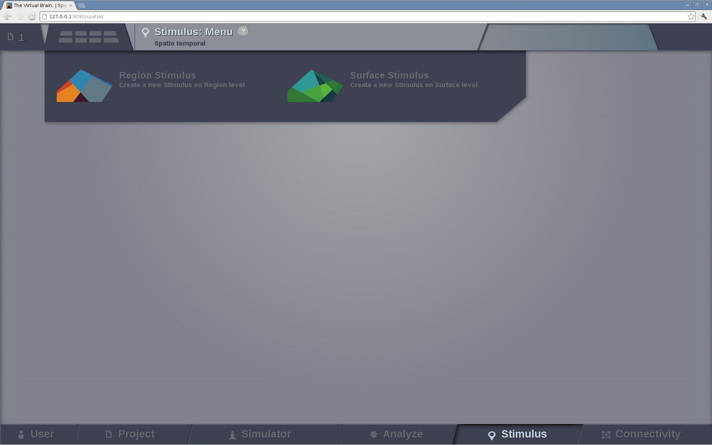

Stimulus
--------

Spatio-temporal patterns can be generated to create stimulation patterns.

   Preview for Stimulus Area

.. note:: 
  
   **You can build stimuli for region-based and surface-based simulations**

Region level stimulus
.....................

In this page we can define a stimulus temporal profile for each node independently. 

    .. figure:: screenshots/stimulus_region.jpg
      :width: 90%
      :align: center

- On the left column, you will find configurable fields that will allow you to:
	
    - load a  preexistent `Region Stimulus` entity,
    - enter the name for a new entity and
    - select the associated `Connectivity` matrix that will be used to create a stimulus pattern.

Additionally, you can:

    - select the Temporal Equation that defines the profile and 
    - modify its parameters.

- On the right column, the stimulus temporal profile is presented.  

From the action bar in the right side click on:

   - `Set Region Scaling` button to a access new page where you can:

	- select the nodes to which the temporal stimulus will be applied and
        - set the scaling value (stimulus strength) for those nodes.

	.. figure:: screenshots/stimulus_view_region.jpg
	   :width: 90%
	   :align: center

	   Preview for node selection in Stimulus at a region level

   - `Save New Stimulus Region` button to create the new stimulus entity.
 

Surface level stimulus 
......................

In the case of a surface level stimulus, besides the temporal profile, you can define the spatial profile
of your pattern.

    .. figure:: screenshots/stimulus_surface.jpg
      :width: 90%
      :align: center

On the left column:

    - select the Spatial Equation that describes the spatial spread of the stimulus and
    - set its parameters.

.. tip::

	You can increase the complexity of a stimulus pattern by keep building on top of one Stimulus entity.
        For an example on how to do it, please read the Test Cases in the User Guide document.

